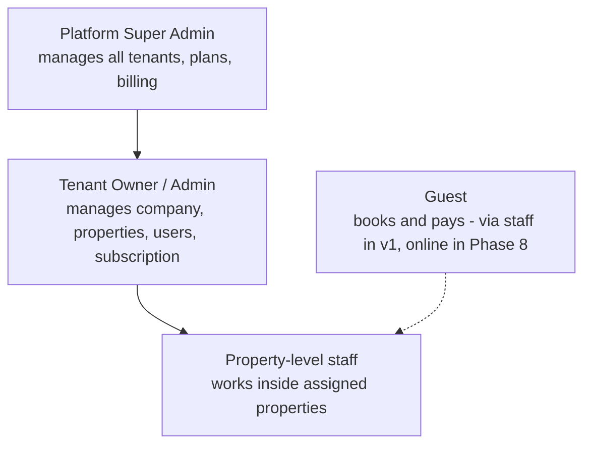
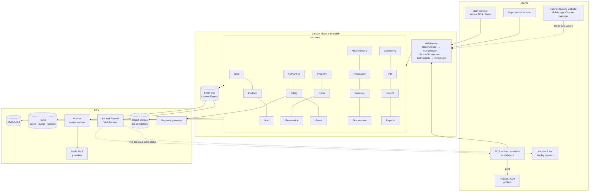
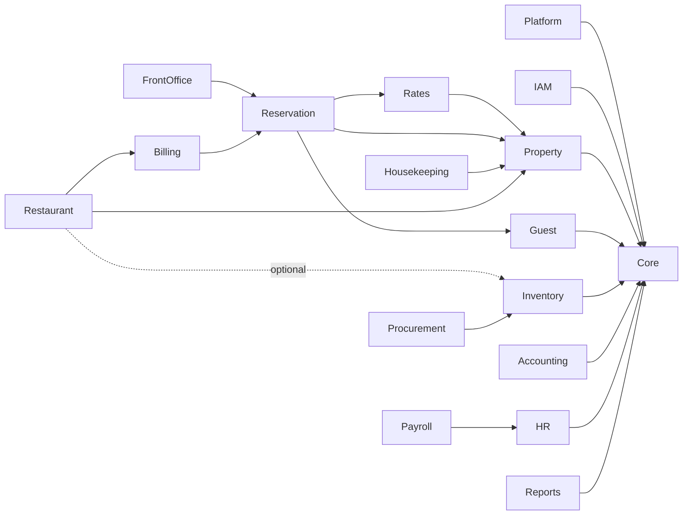
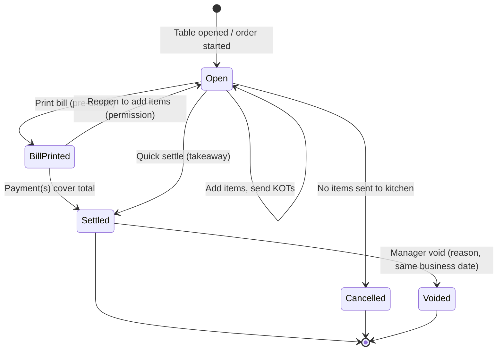
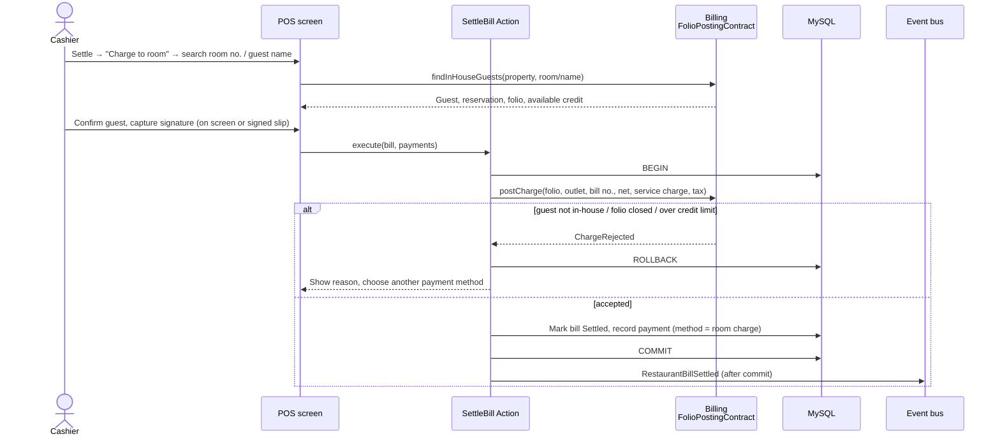
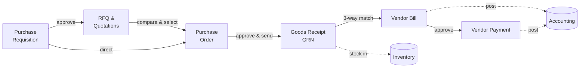
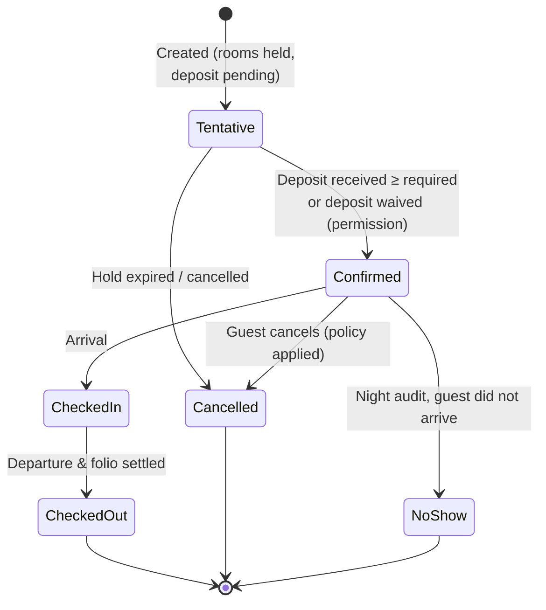
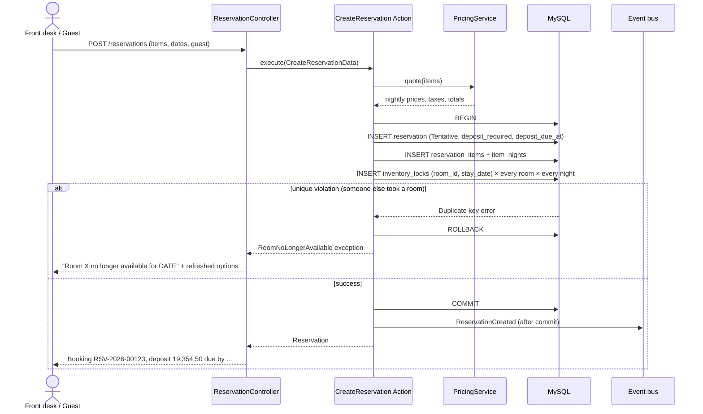
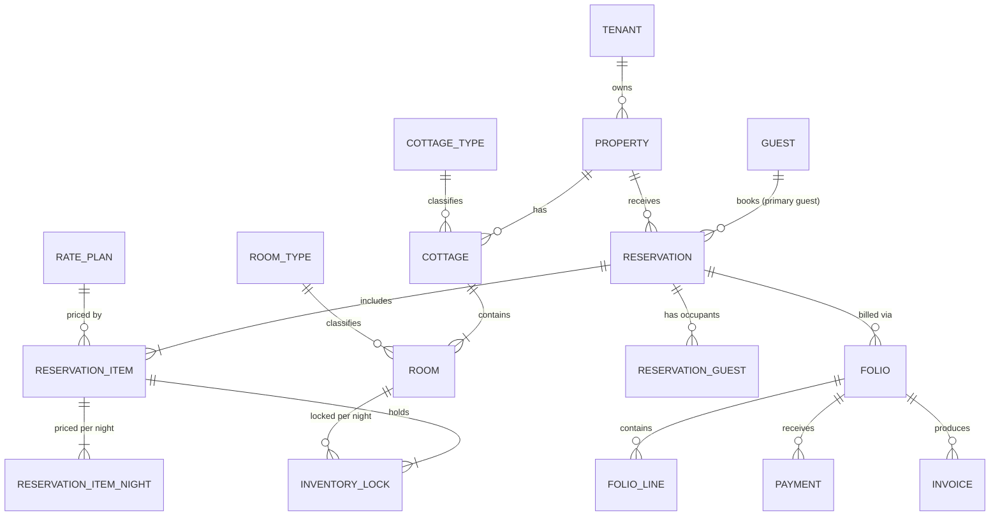
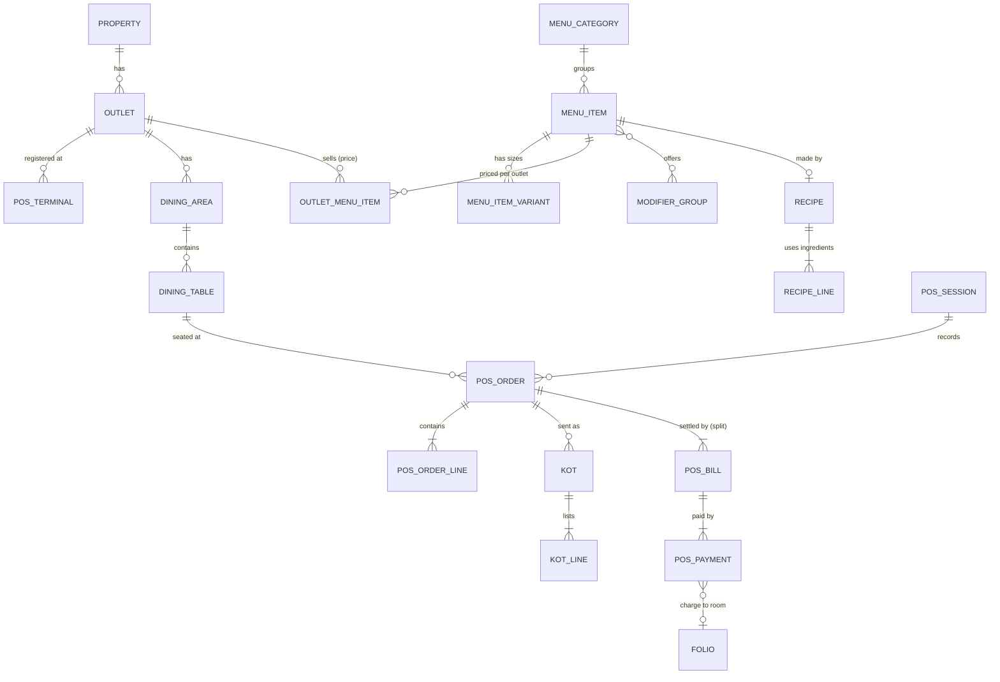

# Resort365 — SaaS Resort Management System

**Architecture & Requirements Specification**

| | |
|---|---|
| Version | 0.2 — Draft for review |
| Date | 2026-09-27 |
| Stack | Laravel 13.x · PHP 8.4 · MySQL 8.4 · AdminLTE 4 · Blade |
| Status | Awaiting stakeholder review (see [§17 Open Questions](#17-open-questions-for-review)) |

**Revision history**

| Version | Change |
|---|---|
| 0.1 | Initial architecture: SaaS, booking, front office, inventory, procurement, accounting, HR, payroll |
| 0.2 | Added the **Restaurant (F&B / POS)** module ([§5.10](#510-restaurant-fb--pos)): outlets, menus, tables, POS orders, kitchen tickets, kitchen display, room charges, meal-plan redemption, recipe costing |

---

## Table of Contents

1. [Overview](#1-overview)
2. [Key Architecture Decisions](#2-key-architecture-decisions)
3. [Users, Roles & Access](#3-users-roles--access)
4. [System Architecture](#4-system-architecture)
5. [Module Catalogue](#5-module-catalogue)
6. [Booking Engine — Detailed Design](#6-booking-engine--detailed-design)
7. [Finance & Accounting Integration](#7-finance--accounting-integration)
8. [Data Model](#8-data-model)
9. [Cross-Cutting Concerns](#9-cross-cutting-concerns)
10. [UI / UX with AdminLTE 4](#10-ui--ux-with-adminlte-4)
11. [Project Structure](#11-project-structure)
12. [Coding Conventions](#12-coding-conventions)
13. [Testing Strategy](#13-testing-strategy)
14. [Deployment & Operations](#14-deployment--operations)
15. [Delivery Roadmap](#15-delivery-roadmap)
16. [Building with Claude Code](#16-building-with-claude-code)
17. [Open Questions for Review](#17-open-questions-for-review)

---

## 1. Overview

### 1.1 Purpose

Resort365 is a multi-tenant, subscription-based (SaaS) platform for running resorts. One installation serves many resort companies. Each company's data is completely isolated from the others. The system covers the full operating cycle of a resort:

- **Guest-facing operations:** reservations, front office, housekeeping, restaurant & bar
- **Back-office operations:** inventory, procurement, accounting, HR, payroll

### 1.2 Core Business Requirements

| # | Requirement |
|---|---|
| BR-01 | Serve multiple resorts from one application; every resort's data is strictly separated. |
| BR-02 | A resort has multiple **cottages**. |
| BR-03 | A cottage contains **one or many rooms**. |
| BR-04 | A guest can book a single room, multiple rooms, a full cottage, or multiple full cottages, in any combination, in one reservation. |
| BR-05 | Cottage and room bookings require an **advance deposit**, configurable at 30–50% of the total. |
| BR-06 | A booking can cover one night or many nights. |
| BR-07 | Manage resort **inventory** (stores, stock, consumption). |
| BR-08 | Manage **procurement** (requisition → purchase order → goods receipt → vendor bill → payment). |
| BR-09 | Manage **accounts** (income, expenses, receivables, payables, ledgers, financial statements). |
| BR-10 | Manage **staff** (HR records, attendance, leave) and **payroll**. |
| BR-11 | Manage the resort's **restaurant(s) and bars**: menus, table service, orders, kitchen, billing. Serve both in-house guests (with charge to room) and outside walk-in customers. |

### 1.3 Scope Extensions (added for a professional, international-grade product)

- SaaS platform layer: plans, subscriptions, per-tenant module activation, super-admin console.
- Rate management: seasons, rate plans, meal plans, restrictions, cancellation policies.
- Front office: check-in/out, room moves, guest folios, **night audit**, business date.
- Housekeeping & maintenance: room status, tasks, out-of-order blocks, work orders.
- Restaurant & bar: multiple outlets, touch POS, kitchen order tickets (KOT) and kitchen display, room service, charge to room, meal-plan redemption, recipe-based food costing.
- Guest CRM: profiles, ID documents, stay history, preferences, blacklist.
- Double-entry accounting aligned with **USALI** (Uniform System of Accounts for the Lodging Industry).
- Hospitality KPIs: Occupancy %, ADR, RevPAR, revenue by source.
- Multi-currency, multi-language, multi-timezone, configurable taxes.
- Audit trail, approval workflows, document numbering, notifications.

### 1.4 Out of Scope for v1 (planned later)

- Offline POS mode (taking orders while the internet is down). v1 POS needs a network connection. See Q19.
- Online food ordering and third-party delivery platforms.
- OTA channel-manager integration (Booking.com, Expedia, and so on).
- Native mobile apps (the REST API is designed to support them).
- Guest self-service portal and public booking website (planned for Phase 8).

### 1.5 Glossary

| Term | Meaning |
|---|---|
| **Tenant** | A subscribing customer account, usually a resort company. The top-level isolation boundary. |
| **Property** | One physical resort owned by a tenant. A tenant can have many properties. |
| **Cottage** | A building or villa inside a property. It can be booked whole. |
| **Room** | The smallest bookable space. Every room belongs to exactly one cottage. |
| **Room Type / Cottage Type** | Classifications used for pricing and display (for example *Deluxe King*, *3-Bedroom Family Villa*). |
| **Reservation** | A booking made by a guest. It contains one or more **reservation items**. |
| **Reservation Item** | One booked unit: either a single room or a whole cottage, for a date range. |
| **Stay Night / Stay Date** | A night the guest occupies a room. A stay from 10 Jan to 13 Jan covers nights 10, 11 and 12. |
| **Inventory Lock** | A row that reserves one room for one night. It is the core mechanism against double booking. |
| **Folio** | The guest's running account of charges and payments. |
| **Night Audit** | The end-of-day process: posts room charges, marks no-shows and advances the business date. |
| **Business Date** | The property's operational date, which can differ from the calendar date until night audit runs. |
| **Rate Plan** | A pricing package (for example *Bed & Breakfast, Non-Refundable*). |
| **Meal Plan** | EP (room only), CP (breakfast), MAP (half board) or AP (full board). |
| **ADR / RevPAR** | Average Daily Rate / Revenue Per Available Room. |
| **PR / PO / GRN** | Purchase Requisition / Purchase Order / Goods Received Note. |
| **Outlet** | A point of sale inside a property: main restaurant, pool bar, café, room service, and so on. |
| **POS** | Point of Sale: the touch screen used to take orders and settle bills. |
| **KOT / BOT** | Kitchen Order Ticket / Bar Order Ticket: the order sent to a kitchen or bar station. |
| **KDS** | Kitchen Display System: a screen in the kitchen that shows tickets instead of paper. |
| **Cover** | One diner. Covers are the standard measure of restaurant volume. |
| **Modifier** | An option on a menu item (e.g. *extra cheese*, *no onion*, *medium rare*). |
| **Recipe (BOM)** | The ingredients and quantities that make up one portion of a menu item. |
| **Room charge** | Settling a restaurant bill by posting it to an in-house guest's folio. |
| **Meal-plan redemption** | A guest on a CP/MAP/AP package eating a meal already included in their room rate. |
| **X / Z report** | Mid-shift (X) and end-of-shift (Z) sales summary for a POS session. |
| **CoA / GL** | Chart of Accounts / General Ledger. |

---

## 2. Key Architecture Decisions

| # | Decision | Choice | Rationale |
|---|---|---|---|
| AD-01 | Architecture style | **Modular monolith** | One deployable Laravel app, split into self-contained modules with explicit boundaries. It is far simpler to build and operate than microservices, and a module can still be extracted later. |
| AD-02 | Module system | `nwidart/laravel-modules` | The de-facto Laravel module standard. Each module has its own routes, views, migrations, config, tests and service provider. |
| AD-03 | Multi-tenancy | **Single database, shared schema, `tenant_id` on every tenant-owned table**, enforced by a global scope | Cheapest to run and simplest to migrate. Cross-tenant platform reporting stays easy. Isolation is enforced in code *and* covered by automated tests. *(Alternative: one database per tenant. See [§17](#17-open-questions-for-review) Q1.)* |
| AD-04 | Tenant identification | Subdomain: `{tenant}.resort365.app` | Clear separation for users; allows custom domains later. |
| AD-05 | Tenant hierarchy | Tenant → Properties → Cottages → Rooms | Supports resort groups that run several resorts under one account. |
| AD-06 | Bookable unit | **The room is the atomic unit of inventory.** A whole-cottage booking locks all of the cottage's rooms. | One availability engine covers every booking combination (see [§6](#6-booking-engine--detailed-design)). |
| AD-07 | Double-booking prevention | Database `UNIQUE(room_id, stay_date)` on `inventory_locks`, inside a transaction | Correct under concurrency without relying on application-level checks. |
| AD-08 | Inter-module communication | Public **contracts** (interfaces) for queries; **domain events** for side effects | Keeps modules loosely coupled. Accounting, for example, listens to events and never reaches into Billing tables. |
| AD-09 | Accounting | Double-entry GL with automatic posting from operational modules | Required for any serious financial reporting and audit. |
| AD-10 | Authorization | `spatie/laravel-permission` with *teams* = tenant, plus a user↔property access pivot | Tenant-scoped roles, with each user restricted to the properties they may access. |
| AD-11 | UI | Server-rendered Blade + AdminLTE 4 (Bootstrap 5.3) + Alpine.js for small interactions | Matches the requested stack. No SPA complexity. |
| AD-12 | Money | `DECIMAL(15,2)` columns + a currency code on every financial document; `brick/money` for arithmetic | Avoids floating-point errors and supports multiple currencies. |
| AD-13 | Time | Store timestamps in UTC; stay dates as `DATE`; display in the property timezone | Correct behaviour for properties in different time zones. |
| AD-14 | Primary keys | `BIGINT UNSIGNED` auto-increment | Simple and fast. Tenant scoping prevents cross-tenant access by ID. |
| AD-15 | Restaurant POS UI | A **dedicated full-screen, touch-first layout** (Blade + Bootstrap 5 + Alpine.js), separate from the AdminLTE admin layout. Restaurant back-office screens (menus, recipes, reports) stay in AdminLTE. | Waiters and cashiers need large buttons and few clicks on tablets. The admin sidebar layout suits managers, not the service floor. |
| AD-16 | Charge to room | Restaurant calls Billing's `FolioPostingContract` **synchronously**, inside the settlement transaction | The guest must be verified as in-house (and within credit limit) *before* the bill is closed. An asynchronous event could not reject the charge. |
| AD-17 | Real-time updates | Laravel Reverb (WebSockets) for the kitchen display, table status and new-order alerts, with a polling fallback | Kitchens need tickets within a second or two; polling every few seconds from many screens wastes resources. |

---

## 3. Users, Roles & Access

### 3.1 Actor Levels



### 3.2 Default Roles (per tenant; tenants can create custom roles)

| Role | Main permissions |
|---|---|
| Tenant Owner | Everything in the tenant, including subscription and billing |
| General Manager | All operational and financial modules for assigned properties; approvals |
| Front Office Manager | Reservations, front office, guests, folios, rates (view), reports |
| Front Desk Agent | Create and modify reservations, check-in/out, take payments |
| Reservation Agent | Create and modify reservations, quotes, deposits |
| Housekeeping Supervisor | Room status, housekeeping tasks, lost & found |
| Maintenance Technician | Work orders assigned to them |
| F&B Manager | Everything in the Restaurant module for assigned outlets: menus, prices, recipes, voids and discounts approval, reports |
| Outlet Cashier | Open/close POS sessions, settle bills, take payments, charge to room |
| Waiter / Captain | Open tables, take orders, send KOTs, print bills. Cannot void sent items or give discounts without approval. |
| Chef / Kitchen Staff | Kitchen display: accept, prepare, mark ready; record wastage |
| Bartender | Bar display and bar orders |
| Store Keeper | Inventory: receive, issue, transfer, stock count |
| Procurement Officer | Requisitions, RFQs, purchase orders, vendors |
| Accountant | Accounting, expenses, vendor bills, payments, bank reconciliation |
| HR Manager | Employees, attendance, leave, shifts |
| Payroll Officer | Payroll runs, payslips, loans |
| Auditor | Read-only access to everything, including the audit log |

### 3.3 Access Rules

1. A user belongs to **exactly one tenant** (`users.tenant_id`). Email is unique per tenant.
2. A user can access **one or more properties** (`property_user` pivot). The navbar has a **property switcher**.
3. Permissions are granular: `module.resource.action`, for example `reservation.booking.create`, `accounting.journal.post` or `payroll.run.approve`.
4. Sensitive actions need specific permissions: override rates, waive deposit, void payment, reopen closed period, approve payroll, void a KOT item, give a restaurant discount, issue a complimentary bill.
5. Restaurant staff can be restricted to specific **outlets** (`outlet_user` pivot), in the same way as properties.
6. On shared POS terminals, a manager can approve a single action (void, discount) by entering a **manager PIN** without logging the waiter out. The approval is recorded against the manager.
7. Platform super admins live in a separate table and auth guard (`platform`). They can impersonate a tenant user only with a reason, and every impersonation is audited.

---

## 4. System Architecture

### 4.1 High-Level View



### 4.2 Multi-Tenancy Design

**Model:** single database with a shared schema. Every tenant-owned table has `tenant_id`. Property-level tables also have `property_id`.

**Enforcement layers** (defence in depth):

| Layer | Mechanism |
|---|---|
| Request | The `IdentifyTenant` middleware resolves the tenant from the subdomain and binds `TenantContext` in the container. Unknown or suspended tenants get a 404 or a "suspended" page. |
| Auth | `EnsureUserBelongsToTenant` rejects a session whose `user.tenant_id` does not match the resolved tenant. |
| Model | The `BelongsToTenant` trait adds a global scope (`where tenant_id = ?`) and auto-fills `tenant_id` on create. |
| Property | The `BelongsToProperty` trait scopes queries to properties the user can access. The current property comes from the session. |
| Validation | `Rule::exists(...)` and `Rule::unique(...)` checks always include `tenant_id`. A helper `TenantRule::exists('rooms')` makes this the default. |
| Queue | Jobs implement `TenantAware`. The tenant id is serialized with the job, and job middleware restores `TenantContext` before `handle()`. |
| Scheduler | Tenant-level scheduled tasks (night audit, hold expiry) loop over active tenants and properties, setting context for each. |
| Cache | Cache keys are prefixed `t:{tenant_id}:`. |
| Files | Storage paths are prefixed `tenants/{tenant_id}/…`. Files are served through signed, authorized routes only. |
| Tests | Every tenant-owned model gets an automated "cannot see other tenant's data" test (see [§13](#13-testing-strategy)). |

**Central (non-tenant) tables:** `tenants`, `plans`, `subscriptions`, `platform_admins`, `platform_invoices`, `currencies`, `countries`, `timezones`.

**Implementation notes (Step 0.4):**

- The `Tenant` model and the tenancy base classes live in the application shell (`app/Models`, `app/Support/Tenancy`), not in a module, because every module depends on them and the shell must never depend on a module. The Platform module manages the tenant lifecycle through them.
- Tenant scoping **fails closed**. Using a tenant-owned model without a current tenant throws, instead of returning every tenant's rows. Console commands, seeders and jobs set the tenant with `TenantContext::run()`, or through `TenantAware` job middleware.
- `BelongsToTenant` also refuses to change `tenant_id` and to save or delete another tenant's record, because Eloquent's `save()` bypasses global scopes.
- A suspended tenant gets the suspended page with HTTP 403. A cancelled tenant is treated as unknown (404).

**Tenant onboarding flow:** sign up on the central domain → choose a plan (or start a trial) → create the tenant and owner user → setup wizard (company details, first property, currency, timezone, taxes, cottages and rooms) → seed defaults (roles, chart of accounts, document sequences, settings).

### 4.3 Modular Architecture

Each business capability is a **module** under `Modules/`. A module:

- owns its database tables. No other module writes to them.
- exposes **contracts** (PHP interfaces in `Modules/X/app/Contracts`) that other modules may call for queries or commands.
- emits **domain events** that other modules may listen to.
- registers its own routes, views, menu items, permissions, settings and scheduled tasks through its service provider.
- can be **enabled or disabled per tenant** according to their subscription plan. Routes and menus for a disabled module are hidden and return 403.

#### Module dependency graph (arrows = "depends on")



Property also depends on IAM's `UserDirectory` contract (to assign users to properties); IAM does not depend on Property.

Restaurant depends on Billing's contract (for charge to room). It depends on Inventory only **optionally**: if a tenant has not enabled Inventory, recipe-based stock deduction is simply switched off and the POS still works.

Accounting has **no compile-time dependency** on Billing, Restaurant, Procurement, Inventory or Payroll. It only *listens* to their events and maps them to journal entries. So a tenant can run Accounting without Procurement, and the reverse.

**Rule:** no circular dependencies. A downstream module reacts to an upstream module's events. An upstream module never calls a downstream one.

### 4.4 Layering Inside a Module

```
HTTP Request
   │
   ▼
Route ─► Middleware ─► Controller (thin: authorize, validate, delegate, respond)
                          │
                          ├─► FormRequest (validation + authorization)
                          ▼
                   Action / Service (business logic, transactions)
                          │
            ┌─────────────┼───────────────┐
            ▼             ▼               ▼
         Models       Contracts of     Domain Events
       (Eloquent)    other modules    (dispatched after commit)
                                          │
                                          ▼
                                 Listeners / Queued Jobs
```

| Layer | Responsibility | Rule |
|---|---|---|
| Controller | HTTP concerns only | No business logic, no queries beyond route-model binding |
| FormRequest | Validation and authorization | All input validated here |
| Action | One use case (`CreateReservation`, `PostJournalEntry`) | Owns the DB transaction; returns a model or DTO |
| Service | Reusable domain logic (`PricingService`, `AvailabilityService`) | Stateless |
| DTO | Typed data passed between layers | Immutable `readonly` classes |
| Model | Persistence, relationships, casts, scopes | No cross-module writes |
| Policy | Record-level authorization | One policy per aggregate |
| Event / Listener | Side effects and cross-module reactions | Events dispatched `afterCommit` |
| Enum | Statuses and types | PHP backed enums, never magic strings |

### 4.5 Domain Events (cross-module contract)

| Event | Emitted by | Consumed by → effect |
|---|---|---|
| `ReservationCreated` | Reservation | Notifications → booking acknowledgement with deposit instructions |
| `ReservationConfirmed` | Reservation | Notifications → confirmation voucher |
| `ReservationCancelled` | Reservation | Billing → cancellation fee / refund; Notifications |
| `PaymentReceived` | Billing | Reservation → update payment status, auto-confirm if deposit met; Accounting → post receipt *(Step 1.7: the event carries the reservation's total paid, so Reservation sets it rather than adding to it)* |
| `RefundIssued` | Billing | Accounting → post refund |
| `GuestCheckedIn` | FrontOffice | Housekeeping → room status *Occupied* |
| `GuestCheckedOut` | FrontOffice | Housekeeping → room *Dirty*, create cleaning task; Billing → finalize invoice |
| `NightAuditCompleted` | FrontOffice | Accounting → post the day's revenue; Reports → snapshot daily statistics |
| `KotSent` | Restaurant | Kitchen display (via Reverb) → new ticket appears; printer queue → KOT printed at the station |
| `KotItemStatusChanged` | Restaurant | POS (via Reverb) → waiter sees "ready to serve" |
| `KotItemVoided` | Restaurant | Kitchen display → cancel ticket line; audit log; F&B Manager notification if above threshold |
| `RestaurantBillSettled` | Restaurant | Accounting → post F&B revenue, taxes, payments; Inventory → deduct recipe ingredients from the outlet's store; Reports → sales statistics |
| `RestaurantBillVoided` | Restaurant | Accounting → reverse postings; Inventory → reverse consumption (if food was not prepared) |
| `PosSessionClosed` | Restaurant | Accounting → post cash over/short; Notifications → Z-report to the F&B Manager |
| `RoomOutOfOrder` | Housekeeping | Reservation → locks inventory; alert if the room has bookings |
| `StockBelowReorderLevel` | Inventory | Procurement → suggest requisition; Notifications |
| `GoodsReceived` | Procurement | Inventory → stock in; Accounting → Dr Inventory / Cr GRNI |
| `VendorBillApproved` | Procurement | Accounting → Dr GRNI (or Expense) / Cr Accounts Payable |
| `VendorPaymentMade` | Procurement | Accounting → Dr AP / Cr Bank |
| `StockIssued` | Inventory | Accounting → Dr Department Cost / Cr Inventory |
| `StockAdjusted` | Inventory | Accounting → shrinkage / gain |
| `PayrollApproved` | Payroll | Accounting → accrue salaries |
| `PayrollPaid` | Payroll | Accounting → Dr Salary Payable / Cr Bank |

### 4.6 Technology Stack

| Area | Choice |
|---|---|
| Language / framework | PHP 8.4 (8.3 minimum), Laravel 13.x (latest stable at project start) |
| Database | MySQL 8.4 LTS (InnoDB, `utf8mb4`). The schema stays PostgreSQL-compatible. |
| Cache / queue / session | Redis 7 |
| Queue monitoring | Laravel Horizon |
| Real-time | Laravel Reverb (WebSockets) + Laravel Echo on the client, for the kitchen display, table status and POS alerts |
| Receipt / KOT printing | v1: browser printing with 80 mm thermal print CSS. Upgrade: QZ Tray or a small local print agent for silent printing to network ESC/POS printers (see Q17). |
| Modules | `nwidart/laravel-modules` |
| Auth | Laravel Fortify (login, 2FA, password reset) + Sanctum (API tokens) |
| Roles / permissions | `spatie/laravel-permission` (teams enabled) |
| Audit log | `spatie/laravel-activitylog` |
| Files / media | `spatie/laravel-medialibrary` on S3-compatible storage |
| Money | `brick/money` |
| PDF | `spatie/laravel-pdf` (or `barryvdh/laravel-dompdf`) for invoices, vouchers, payslips |
| Excel import/export | `maatwebsite/excel` |
| Data tables | `yajra/laravel-datatables` (server-side) + DataTables Bootstrap 5 |
| SaaS billing | Laravel Cashier (Stripe), or manual invoicing (see Q12) |
| Admin theme | AdminLTE 4.x (Bootstrap 5.3, vanilla JS), Bootstrap Icons |
| Front-end build | Vite |
| JS helpers | Alpine.js, Tom Select, flatpickr, SweetAlert2, Chart.js |
| Testing | Pest, Laravel Dusk (critical browser flows) |
| Code quality | Laravel Pint, Larastan (level 6+), Rector |
| CI | GitHub Actions |

> Package versions must be checked for Laravel 13 compatibility when the project is initialized.

---

## 5. Module Catalogue

Each module lists its **purpose**, **features**, **key entities** and **business rules**. The detailed tables are in [§8](#8-data-model).

### 5.1 Core

Shared infrastructure used by every module.

- Tenancy context, `BelongsToTenant` / `BelongsToProperty` traits, tenant-aware jobs.
- **Settings engine:** typed key/value settings at tenant and property level, for example `checkin_time`, `checkout_time`, `default_deposit_percent`, `currency`, `timezone`, `date_format`.
- **Document numbering:** configurable sequences per tenant, property and document type, e.g. `RSV-2026-00001`, `INV-…`, `PO-…`, `GRN-…`, `JV-…`, `PAY-…`. Generated under a row lock and optionally reset each year. *(Every registered sequence is created when the tenant is created, so taking a number is always a single row lock. Creating a sequence on first use under concurrent load can deadlock on gap locks.)*
- **Approval workflow engine:** a generic multi-level approval process for any "approvable" document (PR, PO, vendor bill, leave, payroll, refund) with amount-based thresholds. Example: PO < 50,000 → Purchase Manager; ≥ 50,000 → General Manager.
- **Notifications:** email, SMS and in-app channels; per-tenant templates with placeholders; a WhatsApp channel can be added later. *(Step 1.8: modules register `NotificationTemplateDefinition`s (key, channel, default subject and body, placeholders, label, description); tenants rewrite them at Setup → Email templates (`notification_templates`, permission `core.notification-template.manage`) and can reset them to the default. Templates are plain text with `{placeholders}`; the first line of an email is its greeting. SMS is not built yet.)*
- **Tax engine:** configurable taxes and charges (VAT, service charge, tourism levy, city tax) with percentage or fixed amount, inclusive or exclusive, compound flag, and tax categories. Shared by Rates (room pricing), Billing (extras) and Restaurant (bills). *(Implemented in Step 1.3 as `TaxEngine` / `TaxCalculator`: taxes are applied in calculation order, a compound tax on the net plus the taxes before it, a fixed tax per unit; each tax line is rounded half-up to 2 places, and for inclusive prices net = gross − taxes. Whether an amount includes tax is a property of the **price** (a rate plan's `prices_include_tax`, an outlet's `prices_include_tax`), not of each tax. Taxes have no effective dates yet.)*
- **Audit log:** every create, update and delete on business records, plus login history.
- **Attachments:** a polymorphic file-attachment component usable by any module.
- **Reference data:** countries (ISO 3166), currencies (ISO 4217), timezones, languages.
- **Menu and permission registry:** modules register their sidebar items and permissions here. *(Implemented in `app/Support/Menu` and `app/Support/Authorization` rather than the Core module, because the application shell registers its own items too and must not depend on a module. Every module uses them.)*

### 5.2 Platform (SaaS)

- Tenant lifecycle: sign up, trial, active, suspended, cancelled, and data export on exit.
- **Plans** with limits (`max_properties`, `max_rooms`, `max_users`, `storage_gb`) and **module entitlements**. Example: *Starter* = Property + Reservation + FrontOffice; *Professional* adds Restaurant + Inventory + Procurement + Accounting; *Enterprise* = all modules plus API access. Restaurant can also be sold as an add-on, with a limit on the number of outlets and POS terminals.
- Subscriptions, platform invoices and payment (Stripe through Cashier, or manual).
- Super-admin console: tenant list, usage metrics, suspend/reactivate, impersonation (audited), plan management, system announcements.
- Limit enforcement: a friendly block when a tenant exceeds their plan (for example "Room limit reached — upgrade plan").

### 5.3 IAM (Identity & Access Management)

- Users, invitations, login, 2FA (TOTP), password policy, session management, forced logout.
- Roles and permissions (tenant-scoped), property access assignment.
- Personal preferences: language, theme (light/dark), default property.
- Security: login throttling, IP allow-list (optional per tenant), last-login display.

### 5.4 Property

Master data for the physical resort.

- **Properties:** name, legal name, address, contact details, country, timezone, currency, tax registration numbers, logo, check-in/check-out times, **business date**.
- **Cottage types:** e.g. *Family Villa*, *Honeymoon Cottage*, with description, photos and amenities.
- **Cottages:** number/name, type, zone/location, **booking mode** (`rooms_only`, `whole_only`, `both`), status.
- **Room types:** e.g. *Deluxe King*, *Twin*, with base occupancy, max adults and children, bed configuration, size and amenities.
- **Rooms:** number, cottage, room type, floor, occupancy overrides, active flag.
- Amenities and facilities catalogue (one per tenant, shared by its properties); photo galleries.
- Departments (Front Office, Housekeeping, F&B, Maintenance, Admin…), one list per tenant, shared by HR, Inventory and Accounting as cost centres.

**Business rules**

- Every room belongs to exactly one cottage. A single-room cottage is simply a cottage with one room, so no special case is needed.
- A cottage's maximum occupancy is the sum of its rooms' occupancy, unless overridden.
- A room with future bookings cannot be deleted. It can only be deactivated after its bookings are moved. (The Property module asks through its `RoomUsage` contract, which the Reservation module implements.)

### 5.5 Rates

- **Seasons:** named date ranges (Peak, Shoulder, Low, Festival) with priority.
- **Rate plans:** code, name, meal plan (EP/CP/MAP/AP), **meal component value** per adult and child per night (the part of the rate that pays for included meals; used for revenue allocation and restaurant redemption), refundable flag, linked **deposit policy** and **cancellation policy**, validity window, channel visibility.
- **Rates:** amount per night for a *rateable* (room type **or** cottage type) × rate plan × season, with optional day-of-week variation (e.g. weekend uplift). Includes extra-adult and extra-child charges.
- **Date overrides:** a specific price for a specific date (events, holidays).
- **Restrictions per date:** minimum stay, maximum stay, closed to arrival (CTA), closed to departure (CTD), stop-sell.
- **Deposit policies** (see [§6.5](#65-advance-deposit)).
- **Cancellation policies:** tiered rules, e.g. *> 14 days: full refund; 7–14 days: 50% of deposit retained; < 7 days or no-show: deposit forfeited*.
- **Taxes and charges:** which Core tax-engine taxes apply to room rates, per property and rate plan.
- **Promotions and discounts:** promo codes, long-stay discounts (e.g. 7+ nights = 10%), corporate rates.

### 5.6 Reservation

The booking engine. See [§6](#6-booking-engine--detailed-design) for the full design.

- Availability search by date range and occupancy, showing available whole cottages and individual rooms.
- Quotes: a saved price proposal that can be emailed and converted into a booking.
- Reservations with multiple items (any mix of rooms and whole cottages, each with its own dates if required).
- Deposit calculation, hold expiry and auto-cancellation of unpaid tentative bookings.
- Modifications: dates, rooms, guests, rate plan, with automatic re-pricing and re-locking.
- Cancellation with policy-driven fees and refunds; no-show handling.
- Group bookings (one master reservation, a rooming list, a master folio).
- Booking sources: walk-in, phone, email, website, travel agent, corporate, OTA.
- Travel agents and corporate accounts, with commission and credit limit.
- Waitlist (optional).
- Booking calendar / **tape chart** (rooms × dates grid).
- Confirmation voucher (PDF and email).
- *Implemented in Step 1.8: quotes are made in the booking wizard ("Save as quote instead"), numbered `QUO-…`, valid for `reservation.quote_valid_days` (7), emailed with a PDF and booked by `ConvertQuote` at the quoted nightly prices (the deposit and its due time are worked out at conversion; rooms are locked then, so a room taken since fails cleanly). Guest emails — booking received (deposit, due time, `reservation.payment_instructions`), confirmed (voucher PDF attached), cancelled (fee, refund), released (deposit not paid) and quotation — are queued (`SendGuestEmail`, tenant-aware) and recorded in the booking's history; the staff member who made an expired booking gets an in-app notice. A booking-source report (bookings, cancellations, unit-nights, revenue, average, share) sits under Reservations.*

### 5.7 Front Office

- Front-desk dashboard: today's arrivals, departures, in-house guests, occupancy, VIPs, pending deposits.
- **Check-in:** verify guest identity (capture ID/passport scan), assign or confirm rooms, collect the balance or a security deposit, issue a registration card (printable).
- **Room move** during a stay, with re-locking of inventory.
- Stay extension or early departure, with re-pricing.
- **Check-out:** settle the folio, issue the final invoice, release rooms, mark them dirty.
- **Night audit** (per property, scheduled or manual):
  1. Verify all check-ins and check-outs for the business date.
  2. Post room and tax charges for each in-house room-night to the folios.
  3. Mark no-shows and apply the no-show policy.
  4. Release expired tentative holds.
  5. Check that all restaurant POS sessions are closed and no restaurant bills are open.
  6. Allocate package rates: split each night's rate into room revenue and F&B revenue (meal component).
  7. Snapshot daily statistics (occupancy, ADR, RevPAR, revenue, F&B covers and sales).
  8. Advance the business date.
- Guest messages, wake-up calls and requests (simple log).

### 5.8 Guest (CRM)

- Guest profiles: name, contact details, nationality, date of birth, ID type and number (encrypted), address, preferences, notes.
- Duplicate detection and merge.
- Stay history and lifetime value.
- VIP level, tags and blacklist (with reason).
- Companies and travel agents (shared with Reservation through the `GuestLookup` contract).
- *Implemented in Step 1.2: profiles, encrypted ID with ID documents, duplicate detection (phone, email, ID document) and merge (`GuestsMerged` event), blacklist, VIP level, companies, travel agents, `GuestLookup`. Not yet scheduled: stay history and lifetime value (need reservations), tags, data export and anonymisation. Since Step 1.7 a merge moves the merged guest's bookings to the kept profile (Reservation listens to `GuestsMerged`).*
- Marketing consent (GDPR-style), data export and anonymization on request.

### 5.9 Billing & Payments

- **Folios:** one or more per reservation (guest folio, company folio, master folio for groups), holding charges (room nights, extras, services, restaurant and bar bills charged to room), payments, adjustments and routing rules (e.g. "company pays room, guest pays F&B").
- **Folio posting contract** (`FolioPostingContract`): the public API that other modules (Restaurant today, spa or laundry later) use to post a charge to an in-house guest's folio. It checks that the reservation is checked in, that the folio is open and that the credit limit is not exceeded.
- **Extra charges catalogue:** airport transfer, extra bed, laundry, spa, excursions, and so on.
- **Payments:** cash, card, bank transfer, mobile wallet, online gateway, and city ledger (bill to a company). Each payment records its type (deposit, payment, refund), currency and exchange rate, and gets a receipt number.
- **Payment gateway abstraction:** a `PaymentGateway` contract with adapters (Stripe, PayPal, SSLCommerz or others per market), webhooks with idempotency, and payment links for deposit requests.
- **Invoices:** issued at check-out or on demand, with sequential numbering, tax breakdown and PDF output. Invoices are immutable once issued; corrections are made with credit notes.
- **Refunds:** policy-driven, and approval-gated above a threshold.
- **Accounts receivable:** a city ledger for company and travel-agent billing, with aging.
- Cashier shifts: open/close shift, cash count, variance report.
- *Implemented in Step 2.1: charge codes (tenant-wide; category for routing, tax category for `TaxEngine`; defaults ROOM, EXBED, FNB, TRANSFER, LAUNDRY, SPA, MISC for new tenants), the extras catalogue (`extra_services`, per property), folios (a guest folio opens with every booking; company, travel-agent and master folios on demand), charges, adjustments (amount incl. tax, may be negative), voids with reason, routing rules per booking and category, and `FolioPostingContract` (in-house, open folio, credit limit: the company's or travel agent's, or `billing.guest_credit_limit` for guest folios). Payments also post a payment line to the guest folio. Staff may post extras before arrival; the in-house rule applies to other modules. Moving lines between folios, invoices and settlement come in Step 2.6.*

### 5.10 Restaurant (F&B / POS)

Runs every food and beverage outlet in the resort. It serves in-house guests (who can charge to their room or use their meal plan) and outside walk-in customers, and it connects to Billing (room charges), Inventory (ingredient consumption) and Accounting (revenue and cost).

#### 5.10.1 Outlets

- A property can have **several outlets**, e.g. *Main Restaurant*, *Pool Bar*, *Beach Grill*, *Café*, *Room Service*, *Mini-bar*.
- Each outlet has: type (restaurant, bar, café, room service, mini-bar), operating hours, linked **inventory store** (where ingredients are deducted from), kitchen stations, printers, tax and service-charge settings, price-inclusive-of-tax flag, revenue account mapping, bill numbering sequence and receipt header/footer.
- POS terminals are registered per outlet (a name and device token), so that sessions, printers and reports are tied to a physical device.

#### 5.10.2 Menu Management

- **Menu categories** (nested, e.g. *Food → Mains → Seafood*), with sort order, colour and image for the POS buttons.
- **Menu items:** code/PLU, name and description (multi-language), image, kitchen station, course (starter, main, dessert, drink), tax category, **price per outlet**, cost (calculated from the recipe), and allergen and dietary tags (vegetarian, vegan, gluten-free, halal, contains nuts…).
- **Variants:** e.g. *half / full*, *glass / bottle*, *small / large*, each with its own price and recipe.
- **Modifier groups:** e.g. *Cooking level* (required, choose 1), *Add-ons* (optional, choose up to 3, with price). A modifier can also change the recipe (e.g. *extra cheese* adds 30 g cheese).
- **Combos and set menus:** a fixed price for a bundle of items (e.g. *Set Lunch: soup + main + drink*).
- **Menu schedules:** which items are sold when, e.g. breakfast 07:00–10:30, all-day menu, dinner, happy-hour prices.
- **Availability ("86"):** mark an item as sold out. It greys out on every POS screen immediately (Reverb).
- **Open items:** a custom-priced item for one-off requests, which needs a permission.
- **Direct-stock items:** bottled drinks and packaged goods linked 1:1 to an inventory item, with no recipe needed.

#### 5.10.3 Tables & Floor Plan

- **Dining areas** (Indoor, Terrace, Pool deck, Beach) and **tables** with number, seats, shape and position on a visual floor plan (arranged by drag and drop in setup).
- Live table status by colour: *available*, *occupied*, *bill printed*, *reserved*, *needs cleaning*. Each occupied table shows how long it has been seated and its running total.
- Operations: open table with number of covers, assign waiter, transfer to another table, **merge** tables, move items between tables, **split** bill.

#### 5.10.4 Order Types

| Type | Description | Typical settlement |
|---|---|---|
| Dine-in | Table service in an outlet | Pay at table, charge to room, package |
| Takeaway | Collected at the counter | Pay immediately |
| Room service | Delivered to a room or cottage; delivery status tracked (ordered → preparing → out for delivery → delivered) | Charge to room (most common) or pay on delivery |
| Location delivery | Delivered to the pool, beach or a cottage terrace, with a free-text location | Charge to room or pay on delivery |
| Staff meal | Meals for employees | Complimentary, costed to staff-meal expense |
| Banquet / event | *Out of scope for v1.* Group events with a fixed menu and per-head price; planned with an Events module later. | — |

#### 5.10.5 Order Lifecycle



Each **order line** has its own status: `pending` (not yet sent) → `sent` → `preparing` → `ready` → `served`, or `voided`.

#### 5.10.6 Kitchen: KOT & Kitchen Display

- When the waiter presses **Send**, the system groups all pending lines by **kitchen station** (hot kitchen, grill, pastry, bar…) and creates one **KOT** per station, with a sequential ticket number per outlet and day.
- Each station receives its ticket on a **kitchen display** (KDS), a printer, or both (configured per station).
- **Courses and "hold & fire":** a waiter can send starters now and hold mains until they press *Fire mains*.
- The KDS shows tickets in order, with elapsed time, colour warnings for late tickets, modifiers and allergy notes in bold. Chefs tap *Start* and *Ready*; the waiter is notified on the POS when a dish is ready.
- **Voids after sending:** the item cannot be deleted. It is voided with a reason (*guest changed mind*, *wrong order*, *quality issue*), and needs permission or a manager PIN. A void KOT is printed or shown to the station. If the food was already prepared, it is recorded as **wastage**.

#### 5.10.7 Billing & Settlement

- **Bill (pre-check):** printed or shown for the guest before payment.
- **Taxes and service charge** per outlet, computed by the shared Core tax engine (inclusive or exclusive pricing).
- **Discounts:** percentage or amount, on an item or the whole bill; a reason is required; each role has a maximum discount %, above which a manager PIN is needed.
- **Split bill:** by item, by seat, equally between N people, or by amount.
- **Multiple payments per bill:** cash (with change calculation), card, mobile wallet, bank transfer, **charge to room**, **city ledger** (bill to a company account), **package** (meal-plan redemption), **complimentary**.
- **Tips:** recorded separately from sales and held as a liability, to be distributed through payroll.
- **Complimentary bills:** reason required (management guest, service recovery, staff meal); valued at cost and charged to the relevant expense account; permission required.
- **Receipts:** sequential bill number per outlet, tax breakdown, optional QR code, and reprint marked "COPY". Walk-in customers can optionally be saved as guest profiles (shared Guest CRM) for loyalty and history.
- **Fiscal compliance:** a `FiscalReceiptContract` adapter allows integration with a country's electronic tax/VAT system where the law requires it (see Q20).

#### 5.10.8 Charge to Room



- Allowed only for **checked-in** guests, and blocked after check-out.
- The folio line keeps a link to the restaurant bill, so the guest sees each bill at check-out and the itemised receipt can be reprinted from the folio.
- A reservation can be flagged **"no room charges"** (e.g. paid by a travel agent with strict terms).

#### 5.10.9 Meal-Plan (Package) Redemption

Resort guests often book a rate that includes meals (CP = breakfast, MAP = half board, AP = full board).

1. At the outlet, the waiter chooses the **package** settlement type and looks up the room.
2. The system checks the entitlement for that business date and meal period: the meal plan of the guest's rate plan × the number of adults and children on the reservation, minus meals already redeemed.
3. Items on the outlet's **package menu** are charged at zero to the guest. Items outside it (e.g. alcohol, premium dishes) are billed normally and can be charged to room.
4. Redemption over the entitlement shows a warning and needs a permission.
5. Each redemption is recorded (covers, items, cost) for headcount, food cost and "meals included but not taken" reports.

**Revenue:** a redemption posts no revenue itself. The meal component of the package rate is recognised as **F&B revenue** during night audit (see [§7.1](#71-default-posting-rules)). This matches USALI package allocation.

#### 5.10.10 Recipes & Food Costing

*(Available when the Inventory module is enabled.)*

- Every menu item (and variant) can have a **recipe**: inventory ingredients with quantity per portion, unit and a yield/wastage %.
- **Sub-recipes** for prepared components (sauces, doughs, stocks) used in several dishes.
- **Plate cost** is calculated from the ingredients' weighted-average cost. The menu screen shows food cost % and a suggested price for a target food cost %.
- **Automatic stock deduction:** when a bill is settled, the ingredients of every sold item and modifier are deducted from the outlet's linked store as a stock movement (type `sale_consumption`). This is done in a queued job, so it never slows the POS.
- **Wastage entry:** kitchen records spoiled or dropped food; it is deducted from stock and costed.
- **Theoretical vs actual:** a physical stock count of the kitchen store compares what *should* have been used (from sales) with what *was* used. The variance reveals waste, over-portioning or theft.

#### 5.10.11 POS Sessions & Cash Control

- A cashier **opens a session** on a terminal with an opening cash float. Every payment is tied to a session.
- **X report** (mid-shift summary) at any time.
- **Closing:** the cashier counts cash by denomination; the system compares it with expected cash and records any over/short with a reason. A **Z report** is produced and the session is locked.
- A session cannot close while it has open bills; open bills must be settled or transferred to another session.
- The restaurant uses the property's **business date**. Night audit is blocked until all outlet sessions for the day are closed (or force-closed by a manager).

#### 5.10.12 Restaurant Table Reservations

- Book a table for a date, time and party size, for an in-house guest (linked to their reservation) or an outside customer.
- Special occasions and notes (birthday, anniversary, allergies).
- Status: booked → seated → completed, or cancelled / no-show. Tables with an upcoming reservation are shown as *reserved* on the floor plan.

#### 5.10.13 Business Rules (summary)

1. Items sent to the kitchen can never be deleted, only voided with a reason and permission.
2. Settled bills are immutable. Corrections are made by a manager void on the same business date, or by a refund afterwards.
3. Bill numbers are sequential and gap-free per outlet.
4. Discounts, voids, comps and reopening a printed bill are permission-controlled and appear in an exceptions report.
5. Charge to room only for checked-in guests, within the folio's credit limit.
6. Prices, taxes and recipes are snapshotted on the bill, so later menu changes never alter past sales.
7. The POS must stay usable on a tablet: two taps to add an item, and no page reloads during an order.

#### 5.10.14 Restaurant Reports

Sales by outlet, category, item, hour, waiter and payment method · covers and average spend per cover · table turnover · void, discount and complimentary (exceptions) report · room-charge summary · package redemption vs entitlement · food cost % and beverage cost % · theoretical vs actual consumption · **menu engineering** (items classified as *stars*, *plowhorses*, *puzzles* and *dogs* by popularity and margin) · X/Z reports and cash over/short.

### 5.11 Housekeeping & Maintenance

- **Room status board:** clean, dirty, inspected, out of order (OOO), out of service (OOS), occupied or vacant.
- **Housekeeping tasks:** auto-generated after check-out and daily for occupied rooms; assigned to attendants; tracked for start, finish and inspection.
- **Amenity consumption:** track toiletries and linen used per room, and issue them from inventory.
- **Maintenance / work orders:** reported by any staff member, then prioritized, assigned, costed (parts from inventory, labour) and closed.
- **OOO blocks:** mark a room unavailable for a date range. This creates inventory locks, so the room cannot be sold.
- Lost & found register.
- Preventive maintenance schedules (e.g. AC servicing every 90 days).

### 5.12 Inventory

- **Item master:** SKU, name, category, base unit of measure (UoM) plus purchase/issue UoM conversions (e.g. 1 box = 24 pcs), stockable or non-stockable, reorder level, reorder quantity, par levels, barcode, optional batch/expiry tracking (for F&B).
- **Stores / warehouses:** main store, kitchen store, housekeeping store, bar, maintenance store. Each is linked to a property and a department. Each restaurant outlet is linked to the store its ingredients are consumed from.
- **Stock movements** (an immutable ledger): receipt, issue, transfer out/in, adjustment, return to vendor, wastage, sale consumption (from restaurant recipes), production (sub-recipes), opening balance.
- **Stock movement contract** (`StockMovementContract`): the public API used by Restaurant to record sale consumption, wastage and production, and by Housekeeping for amenity issues. Every movement records quantity, unit cost and the source document.
- **Stock balance** per item per store: quantity and weighted-average cost. It is updated transactionally with each movement.
- **Store requisition / issue:** a department requests items → approval → store issues them → cost is charged to the department.
- **Inter-store transfers** (two-step: dispatch, receive).
- **Physical stock count:** freeze, count sheets, variance, adjustment.
- **Valuation method:** weighted average (default). FIFO is an optional later enhancement.
- Reports: stock on hand, valuation, movement history, consumption by department, slow-moving stock, expiry, reorder suggestions.

**Business rules**

- Stock cannot go negative (a per-tenant setting allows it for kitchens with late receipts).
- Posted movements are never edited. Corrections are made with reversal or adjustment movements.

### 5.13 Procurement



- **Vendors:** profile, contacts, tax ID, bank details, payment terms, currency, item price list, rating, documents.
- **Purchase requisitions:** created by departments or auto-suggested from reorder levels, then approved through the approval workflow.
- **RFQ and quotation comparison** (optional step): send to several vendors, compare side by side, select the winner.
- **Purchase orders:** from a PR, a quotation or directly; amount-based approval; emailed to the vendor as a PDF; statuses draft, approved, sent, partially received, received, closed, cancelled.
- **Goods receipt (GRN):** full or partial receipt against a PO; accepted versus rejected quantities; the receiving store. Posting it increases stock.
- **Vendor bills:** **3-way match** (PO ↔ GRN ↔ bill) with tolerance; bills can also be for services and expenses without a PO.
- **Vendor payments:** against one or more bills; advance payments; payment vouchers.
- **Purchase returns** to vendor, with debit notes.
- Reports: open POs, pending GRNs, vendor ledger, AP aging, purchase history by item and vendor, price variance.

### 5.14 Accounting

- **Chart of accounts:** hierarchical, with account types Asset, Liability, Equity, Income and Expense. It is seeded from a **USALI-aligned template** (Rooms, F&B, Other Operated Departments, Undistributed Expenses…) and fully editable.
- **Fiscal years and periods:** open, closed or locked. Posting into a closed period is blocked; reopening requires a special permission.
- **Journal entries:** manual and automatic. They must balance (Σ debit = Σ credit). Posted entries are immutable; corrections are made by reversal.
- **Dimensions** on each journal line: property, department (cost centre), party (guest, vendor, employee, company).
- **Cash and bank accounts:** transfers, cheque register, **bank reconciliation** (with statement import).
- **Income entry:** quick income vouchers for non-room income (e.g. event hall rental).
- **Expense entry:** quick expense vouchers with attachments and approval.
- **Receivables and payables:** sub-ledgers fed from Billing and Procurement.
- **Taxes:** tax accounts, tax reports (output VAT versus input VAT).
- **Multi-currency:** base currency per tenant, exchange-rate table, realized FX gain/loss.
- **Financial statements:** trial balance, general ledger, profit & loss (by property and department), balance sheet, cash flow, USALI departmental report.
- **Budgets** (Phase 7+): annual budget per account and department; budget versus actual.
- **Posting rules / account mapping:** a settings screen where the tenant maps each system event to GL accounts (see [§7](#7-finance--accounting-integration)).

### 5.15 HR (Human Resources)

- **Employee master:** employee number, personal details, photo, contacts, emergency contact, national ID and passport (encrypted), property, department, designation, reporting manager, join date, employment type (permanent, contract, seasonal, intern), probation, status, bank details (encrypted), documents (contract, certificates), optional linked user account.
- Organisation setup: departments, designations, grades.
- **Shifts and duty roster:** define shifts (morning, evening, night) and assign a weekly or monthly roster per department.
- **Attendance:** manual entry, bulk import (CSV from biometric devices) or API; late, early-leave and overtime calculation.
- **Leave:** leave types (annual, sick, casual, unpaid, maternity), yearly entitlements, accrual, carry-forward, request → approval, balances, holiday calendar per property.
- Lifecycle events: confirmation, transfer between properties, promotion, increment, disciplinary record, resignation/termination, final settlement.
- Staff accommodation and meals (common in resorts), optional.

### 5.16 Payroll

- **Salary components:** earnings (basic, house rent, allowances, overtime, service charge share, bonus) and deductions (tax, provident fund, loan installment, absence, advance). Each component can be fixed, a percentage of another component, or formula-based, and can be taxable or not.
- **Salary structures:** templates of components; each employee is assigned a structure with **effective-dated** salary records.
- **Payroll run** per property per period: draft → calculate (pulls attendance, overtime, leave-without-pay, loans) → review/adjust → approve → pay → post to accounting. A run is locked after approval.
- **Payslips:** PDF, and email to employees.
- **Loans and salary advances:** with installment schedules deducted automatically.
- **Service charge distribution:** pool the service charge collected in a period and distribute it by rule (equal shares, points, days worked). This is common in resorts and hotels.
- **Income tax:** configurable tax slabs per country or tenant. No country's rules are hard-coded.
- **Bangladesh starter pack** (initial market): seeded components and rules for income tax slabs (withholding from salary), provident fund, gratuity, and the two religious festival bonuses. All seeded values stay editable, because they change with each budget.
- **Tips distribution:** tips collected by the restaurant (held in *Tips Payable*) are distributed with the payroll run, by the same rules as the service charge.
- Bank transfer file export (CSV per bank format), payroll register, statutory reports.

### 5.17 Reports & Analytics

| Area | Reports |
|---|---|
| Management dashboard | Occupancy today/MTD/YTD, ADR, RevPAR, revenue, arrivals and departures, pending deposits, cash position |
| Rooms | Occupancy forecast, room-night statistics, booking pace, source mix, cancellations and no-shows, length of stay |
| Guests | Nationality mix, repeat guests, top guests and companies |
| Finance | Daily revenue report (flash report), deposits held, AR/AP aging, P&L, balance sheet |
| Restaurant | See [§5.10.14](#51014-restaurant-reports): sales, covers, exceptions, food and beverage cost %, menu engineering, X/Z reports |
| Inventory | Stock valuation, consumption per department, per-occupied-room cost of amenities |
| Procurement | Spend by vendor and category, open POs |
| HR / Payroll | Headcount, attendance summary, leave balances, payroll cost by department |

All reports: filter by property (or all properties for consolidation), date range, export to Excel/PDF. Heavy reports run as queued jobs, and the user is notified when the file is ready.

---

## 6. Booking Engine — Detailed Design

This is the most complex part of the system. The design keeps **one inventory mechanism** that correctly handles every combination required by BR-02 to BR-06.

### 6.1 Inventory Model

```
Property
 └── Cottage  (booking_mode: rooms_only | whole_only | both)
      └── Room  (atomic inventory unit)
```

| Scenario | How it is modelled |
|---|---|
| Single-room cottage | A cottage with one room. Booking "the cottage" and booking "the room" are the same thing. The UI shows it as one unit. |
| Multi-room cottage booked by room | One reservation item per room; each locks its own room-nights. |
| Multi-room cottage booked whole | One reservation item of type `cottage`; it locks **every room** in that cottage for every night. |
| Several whole cottages | Several `cottage` items in one reservation. |
| Mix of rooms and cottages | Any combination of items in one reservation. |

**The central rule:** an `inventory_locks` table holds one row per *(room, night)* that is taken, with `UNIQUE(room_id, stay_date)`.

- Room booking A locks room 101 for 10–12 Jan.
- A whole-cottage booking of the cottage that contains room 101 tries to lock rooms 101, 102 and 103 for 11 Jan. The unique index rejects it, because 101 is taken.
- The reverse also holds: if the cottage is booked whole, no single room in it can be booked.

Out-of-order blocks from Housekeeping insert rows into the same table (`lock_type = out_of_order`), so there is **one source of truth for availability**.

### 6.2 Availability Search

Input: property, check-in, check-out, adults, children, optional cottage or room type filter.

```sql
-- Rooms free for every night in [check_in, check_out)
SELECT r.*
FROM rooms r
WHERE r.tenant_id = :tenant
  AND r.property_id = :property
  AND r.is_active = 1
  AND NOT EXISTS (
      SELECT 1 FROM inventory_locks l
      WHERE l.room_id = r.id
        AND l.stay_date >= :check_in
        AND l.stay_date <  :check_out
  );
```

Result assembly (`AvailabilityService`):

1. **Whole cottages available:** cottages with `booking_mode` in (`whole_only`, `both`) where *all* of their rooms are in the free set.
2. **Individual rooms available:** free rooms whose cottage `booking_mode` is in (`rooms_only`, `both`), grouped by room type.
3. Apply rate restrictions (min stay, CTA/CTD, stop-sell) and occupancy limits.
4. Attach a price quote for each option from `PricingService`.

### 6.3 Pricing

`PricingService::quote(item, dates, occupancy, ratePlan, promo)` computes the price **night by night**:

```
for each night in [check_in, check_out):
    base      = date override
                ?? season rate (highest-priority season covering the night, day-of-week aware)
                ?? rate plan base rate
    extras    = extra adults × extra-adult rate + extra children × extra-child rate
    meal      = meal-plan supplement (if not included in rate)
    discount  = promo / long-stay / corporate discount
    net       = base + extras + meal − discount
    taxes     = apply tax rules in order (inclusive/exclusive, compound)
    store as reservation_item_nights row (snapshot)
```

**Whole-cottage pricing:** use the **cottage-type rate** if one is defined. Otherwise use the sum of the room rates, optionally with a whole-cottage discount (a property setting).

*(Step 1.5 implementation notes: `PricingService` with the pure `PriceCalculator`. Meals are **included in the rate**: the plan's meal component (per adult and child per night) is reported as the part of the price that pays for meals, not added as a supplement. The rate covers the type's base occupancy; adults fill it first, then children, and guests beyond it pay the night's extra-adult / extra-child amounts. A whole cottage uses its cottage-type rate per night, else the sum of its active rooms' rates less `reservation.whole_cottage_discount_percent`. The best single promotion (`PromotionMatcher`) is spread over the nights in proportion; taxes are applied per night. Availability (`AvailabilityService` with the pure `AvailabilityCalculator` and `RestrictionChecker`): stop-sell is checked on every night, closed to arrival / minimum / maximum stay on the arrival night, closed to departure on the departure date. Reservation reaches Property and Rates only through `InventoryCatalog` (rooms, cottages, types) and `RateLookup` (plans, nightly rates, restrictions, promotions). `reservation_item_nights` is created with reservations in Step 1.6; `PricedNight` holds the same columns.)*

Prices are **snapshotted** on the reservation, so later rate changes never alter an existing booking. Re-pricing happens only on an explicit modification.

### 6.4 Reservation Lifecycle



Payment status is tracked separately: `unpaid` → `deposit_paid` → `fully_paid` (also `overpaid`, `refunded`, `partially_refunded`).

Item-level statuses allow partial operations, such as one room of a group checking in early.

### 6.5 Advance Deposit

**Deposit policy** (defined per property, with one default, overridable per rate plan; Step 1.4 dropped the per-cottage-type override, since Rates may not write Property's tables — use a rate plan for the cottage type instead):

| Field | Example | Meaning |
|---|---|---|
| `type` | `percentage` | `percentage` \| `fixed_amount` \| `first_night` \| `none` |
| `min_percent` | 30 | Optional lowest deposit staff may ask without the override permission (empty = no limit) |
| `default_percent` | 30 | Amount requested by default (online bookings pay this) |
| `max_percent` | 50 | Optional highest deposit staff may ask (empty = no limit) |
| `due_within_minutes` | 30 | Deadline to pay the deposit after booking (Q7: 30 minutes by default, set per resort) |
| `full_payment_within_hours` | 24 | Ask for the whole stay when arrival is closer than this (rule 6) |
| `auto_cancel_unpaid` | true | Release the hold automatically if the deposit is not paid on time |
| `balance_due` | `at_check_in` | `at_check_in` \| `days_before_arrival` (with `balance_due_days`) |
| `refundable` | per cancellation policy | Linked to the cancellation policy tiers |

**Rules**

1. `deposit_required = round(grand_total × deposit_percent / 100, currency precision)`.
2. The deposit is negotiable per booking (Q7): staff may choose any percentage, within `min_percent` and `max_percent` when the policy sets them. Going below the minimum requires the permission `reservation.deposit.override`, and is logged.
3. The booking stays **Tentative** until `amount_paid ≥ deposit_required`, then it is auto-**Confirmed** by the `PaymentReceived` listener.
4. The hold-expiry job (runs every 5 minutes) cancels tentative bookings past `deposit_due_at` when `auto_cancel_unpaid` is on, releases their locks and notifies the guest and staff. *(Step 1.7: `ExpireTentativeHolds`, scheduled in the scheduler process for every tenant that may use the app, also `php artisan reservation:expire-holds`; the cancellation is free and re-checks the deposit under a row lock, so a payment that arrived first wins. The notifications come with Step 1.8.)*
5. Deposits are posted to a **Customer Advances (liability)** account, not to revenue (see [§7](#7-finance--accounting-integration)).
6. If an arrival is closer than the deposit window (e.g. booking today for tomorrow), the policy can require full or immediate payment.

**Worked example** (tax figures are illustrative):

| Item | Nights | Rate / night | Amount |
|---|---|---|---|
| Cottage "Sunset Villa" (whole, 3 rooms) | 3 | 12,000.00 | 36,000.00 |
| Room B-1 in "Palm Cottage" | 3 | 5,000.00 | 15,000.00 |
| **Subtotal** | | | **51,000.00** |
| Service charge 10% | | | 5,100.00 |
| VAT 15% on (subtotal + SC) | | | 8,415.00 |
| **Grand total** | | | **64,515.00** |
| **Deposit 30% (required to confirm)** | | | **19,354.50** |
| Balance due at check-in | | | 45,160.50 |

### 6.6 Creating a Reservation — Concurrency-Safe Flow



*(Implemented in Step 1.6 as `CreateReservation`, which prices the booking with `BookingQuoter` first — the wizard shows the same quote — and then writes everything in one transaction with deadlock retries. The booking wizard keeps its progress in the session and re-prices on the server at every step. A test runs two parallel PHP processes for the same room-night (and a whole cottage against one of its rooms) ten times each: exactly one booking wins every time.)*

Locks are bulk-inserted in one statement. Correctness relies on the **database constraint**, not on the "check then insert" pattern, which has race conditions.

### 6.7 Modifications, Cancellations & No-Shows

| Operation | Behaviour |
|---|---|
| Change dates / rooms | In one transaction: delete the item's old locks, insert the new ones (a failure rolls back and keeps the original), re-price, recalculate the deposit and balance. |
| Add or remove an item | Lock or release the rooms for that item only; re-price the totals. |
| Room move (in-house) | Re-lock the remaining nights on the new room; the rate can be kept or changed (with permission). |
| Cancel | Release all locks; compute the retention/refund from the cancellation-policy tier based on days before arrival; create the refund request (approval above a threshold). |
| No-show | During night audit, if a confirmed arrival has not checked in: status `NoShow`, release locks from the next night on, apply the no-show fee (usually the deposit is forfeited). |
| Early check-out | Release the future locks; re-price if the rate plan says so. |

History of every change is kept in `reservation_logs` plus the activity log.

*(Step 1.7: `ModifyReservation` replaces the booking's items, nights and locks in one transaction (the lock insert decides; a clash rolls back and keeps the original), keeps the negotiated deposit percent and the deposit due time, and confirms a tentative booking whose payments now cover the deposit. `CancelReservation` charges the cancellation policy's fee (`RateLookup::cancellationQuote`) and stores the fee; the refund of what was paid above it is paid in Step 2.6. `ChangeDeposit` renegotiates the percent (0% waives it), outside the policy only with `reservation.deposit.override`. Other modules add tabs to the reservation page through Reservation's `ReservationTabs` contract (Billing: Payments), since Reservation may not call them. Room moves, no-shows and early check-out come with the front office (Phase 2).)*

### 6.8 Tape Chart (Booking Calendar)

A grid of rooms (grouped by cottage) × dates, showing reservations as coloured bars by status. It supports:

- Clicking an empty cell to start a new booking.
- Clicking a bar to open the reservation.
- Drag-and-drop room moves (Phase 2+), which call the same modify action and so get the same concurrency safety.

It is built as a custom Blade + CSS Grid + Alpine.js component. This avoids commercial calendar licenses such as FullCalendar Scheduler.

---

## 7. Finance & Accounting Integration

Operational modules **never write journal entries directly**. They emit events. The Accounting module's `PostingService` turns each event into a balanced journal entry using the tenant's **account mapping**.

### 7.1 Default Posting Rules

| Event | Debit | Credit |
|---|---|---|
| Deposit received | Cash / Bank | Customer Advances (liability) |
| Night audit — room revenue for the night | Guest Ledger (AR) | Room Revenue; Service Charge Payable; VAT Payable |
| Night audit — package rate with included meals | Guest Ledger (AR) | Room Revenue (room part); F&B Revenue (meal component); taxes |
| Extra charge posted to folio | Guest Ledger (AR) | Relevant revenue account; taxes |
| Restaurant bill settled — cash / card / wallet | Cash / Card Clearing / Wallet Clearing | Food Revenue; Beverage Revenue (by outlet); Service Charge Payable; VAT Payable |
| Restaurant bill settled — charge to room | Guest Ledger (AR) | Food / Beverage Revenue; Service Charge Payable; VAT Payable |
| Restaurant bill settled — city ledger | City Ledger (AR) | Food / Beverage Revenue; Service Charge Payable; VAT Payable |
| Restaurant tip received | Cash / Card Clearing | Tips Payable |
| Restaurant complimentary / staff meal | Entertainment / Staff Meal Expense (at cost) | Inventory |
| Meal-plan redemption | *(no revenue entry — revenue was allocated at night audit)* | — |
| Recipe consumption on sale | Food Cost of Sales / Beverage Cost of Sales (by outlet) | Inventory |
| Kitchen wastage | Food Wastage Expense | Inventory |
| POS session cash short / over | Cash Short Expense / Cash | Cash / Cash Over Income |
| Check-out settlement (deposit applied) | Customer Advances | Guest Ledger (AR) |
| Check-out settlement (balance paid) | Cash / Bank / Card Clearing | Guest Ledger (AR) |
| Settlement to company account | City Ledger (AR) | Guest Ledger (AR) |
| Cancellation fee retained | Customer Advances | Cancellation Revenue |
| Refund | Customer Advances | Cash / Bank |
| Goods received (GRN) | Inventory | Goods Received Not Invoiced (GRNI) |
| Vendor bill (stock items) | GRNI; Input VAT | Accounts Payable |
| Vendor bill (services / expenses) | Expense account; Input VAT | Accounts Payable |
| Vendor payment | Accounts Payable | Cash / Bank |
| Stock issued to department | Department cost (e.g. F&B Cost, HK Supplies) | Inventory |
| Stock count shortage | Inventory Shrinkage | Inventory |
| Payroll approved | Salary & Wages Expense (by department) | Salaries Payable; Tax Payable; PF Payable; Loan Receivable |
| Payroll paid | Salaries Payable | Bank |
| Service charge distributed | Service Charge Payable | Salaries Payable |
| Tips distributed | Tips Payable | Salaries Payable |

**Revenue recognition:** room revenue is recognised **per night at night audit** (the accrual basis and international standard). This is why deposits are held as a liability until the stay happens. *Q8 decided before Phase 2: nightly by default, with a per-tenant setting `billing.revenue_recognition` (`nightly` | `at_checkout`) used by the night audit (Step 2.5) and Accounting.*

**No double counting of restaurant revenue:** when a restaurant bill is charged to a room, the Restaurant posting recognises the revenue (Dr Guest Ledger / Cr F&B Revenue). The folio line that Billing creates is flagged `revenue_posted_by_source = true`, so Billing moves only the receivable and never posts that revenue again.

### 7.2 Accounting Invariants (enforced in code and tests)

1. Every journal entry balances (Σ debit = Σ credit, checked in the base currency).
2. Posted entries are immutable. Corrections are made by reversal entries only.
3. No posting into a closed fiscal period.
4. Every automatic entry references its source (`source_type`, `source_id`), for full drill-down from report to document.
5. Posting is idempotent. The same source event is never posted twice (a unique key on source + event type).

---

## 8. Data Model

### 8.1 Conventions

- Every tenant-owned table has `tenant_id BIGINT UNSIGNED NOT NULL`, indexed, and composite-indexed with the common filters (e.g. `(tenant_id, property_id, status)`).
- Standard columns: `id`, `tenant_id`, `property_id` (where relevant), `created_by`, `updated_by`, `created_at`, `updated_at`. Add `deleted_at` (soft delete) for master data. Financial documents are never deleted; they are cancelled or reversed.
- Money: `DECIMAL(15,2)`; exchange rates: `DECIMAL(18,8)`; quantities: `DECIMAL(15,4)`.
- Enums are stored as `VARCHAR` and backed by PHP enums.
- Foreign keys are enforced at the database level.

### 8.2 Booking Core ERD



### 8.3 Booking Core Tables

**`properties`**
`id, tenant_id, code, name, legal_name, email, phone, address_line1, address_line2, city, state, postal_code, country_code, timezone, currency_code, check_in_time, check_out_time, business_date, tax_registration_no, logo_path, status, settings(json)`
*(Implemented in Step 0.8 without `settings(json)`: property-level settings live in Core's `settings` table. Check-in/out times are these columns, not settings. The logo is stored with the media library, not `logo_path`. `property_user` is owned by the Property module, which uses IAM only through its `UserDirectory` contract. Core's `settings.property_id` and `document_sequences.property_id` have no foreign key by design: Core sits below the Property module, and properties are deactivated, never deleted. This resolves the `TODO(step-0.8)` notes in those Step 0.7 migrations.)*

**`cottage_types`**
`id, tenant_id, property_id, code, name, description, max_occupancy, bedrooms, is_active`

**`cottages`**
`id, tenant_id, property_id, cottage_type_id, code, name, zone, booking_mode(rooms_only|whole_only|both), max_occupancy_override, status(active|inactive), sort_order, description`

**`room_types`**
`id, tenant_id, property_id, code, name, description, base_occupancy, max_adults, max_children, max_occupancy, bed_configuration, size_sqm, is_active`

**`rooms`**
`id, tenant_id, property_id, cottage_id, room_type_id, number, name, floor, max_adults, max_children, housekeeping_status(clean|dirty|inspected), occupancy_status(vacant|occupied), is_active, sort_order`
Unique: `(property_id, number)`
*(Step 1.1 implementation notes: `cottage_types`, `room_types`, `cottages` and `rooms` also have `sort_order` and `deleted_at`; codes are unique per property. A room's empty `max_adults` / `max_children` use its room type's values, and the room type's `max_occupancy` caps every room of the type (adults plus children). A cottage's maximum occupancy is `max_occupancy_override`, or the sum of its active rooms. Deleted rows keep their unique code or room number, because the unique indexes include soft-deleted rows. Photos of cottage types, room types and cottages use the media library's `photos` collection (`HasPhotos`), not gallery tables. As in Phase 0, `created_by` / `updated_by` are not columns: the audit log records who changed what.)*

**`amenities`** (tenant-wide catalogue, shared by the tenant's properties)
`id, tenant_id, name, icon, category(in_room|bathroom|outdoor|service), is_active, sort_order, deleted_at`
Unique: `(tenant_id, name)`

**`amenity_links`** (polymorphic: cottage types and room types)
`id, tenant_id, amenity_id, linkable_type, linkable_id`
Unique: `(amenity_id, linkable_type, linkable_id)`

**`departments`** (tenant-wide; cost centres for HR, Inventory and Accounting)
`id, tenant_id, code, name, description, is_active, sort_order, deleted_at`
Unique: `(tenant_id, code)`

**`guests`**
`id, tenant_id, title, first_name, last_name, email, phone, nationality_code, date_of_birth, id_type, id_number(encrypted), id_expiry, address(json), company_id, vip_level, is_blacklisted, blacklist_reason, preferences(json), marketing_consent, notes`
*(Step 1.2 implementation notes: guests are tenant-wide (shared by the tenant's properties) and soft-deleted. Extra columns: `id_number_hash` (keyed HMAC-SHA256 of the normalised ID type and number, so duplicates can be found while `id_number` stays encrypted; derived from APP_KEY), `blacklisted_at`, `blacklisted_by` and `merged_into_id` (set on the profile removed by a merge). `phone` is stored in international format (`+8801711000000`; local numbers get the `guest.default_calling_code` setting) and `email` in lower case. Indexes start with `tenant_id`: phone, email, id_number_hash, (last_name, first_name), first_name.)*

**`companies`** (Guest module)
`id, tenant_id, name, legal_name, tax_number, contact_person, email, phone, address(json), credit_limit, payment_terms_days, is_active, notes, deleted_at`

**`travel_agents`** (Guest module)
`id, tenant_id, code, name, contact_person, email, phone, address(json), commission_percent DECIMAL(5,2), credit_limit, is_active, notes, deleted_at`
Unique: `(tenant_id, code)`. Credit limits are in the tenant's base currency (`core.currency`).

**`reservations`**
`id, tenant_id, property_id, code, status, payment_status, source, primary_guest_id, company_id, travel_agent_id, check_in, check_out, adults, children, currency_code, exchange_rate, subtotal, discount_total, tax_total, grand_total, deposit_policy_id, deposit_percent, deposit_required, deposit_due_at, amount_paid, balance_due, cancellation_policy_id, promo_code, special_requests, internal_notes, confirmed_at, cancelled_at, cancellation_reason, cancellation_fee, checked_in_at, checked_out_at, created_by`
Indexes: `(tenant_id, property_id, status, check_in)`, `(tenant_id, code)` unique

**`reservation_items`**
`id, tenant_id, reservation_id, item_type(room|cottage), cottage_id, room_id(null for cottage items), room_type_id, cottage_type_id, rate_plan_id, check_in, check_out, adults, children, status, subtotal, discount, tax, total`

**`reservation_item_nights`**
`id, tenant_id, reservation_item_id, stay_date, base_rate, extra_person_amount, meal_amount, discount, net_amount, tax_amount, total_amount, posted_to_folio_at`
Unique: `(reservation_item_id, stay_date)`

**`inventory_locks`**
`id, tenant_id, property_id, room_id, stay_date, lock_type(reservation|out_of_order|owner_block|hold), reservation_id, reservation_item_id, block_id, created_at`
**Unique: `(room_id, stay_date)`**, Index: `(tenant_id, property_id, stay_date)`

**`reservation_guests`** — occupants per item
`id, tenant_id, reservation_id, reservation_item_id, guest_id, is_primary`
*(Step 1.6 implementation notes: `reservations` also has `rate_plan_id` (the plan whose deposit and cancellation policies apply — the first item's), `auto_cancel_unpaid` (copied from the deposit policy for the hold-expiry job), `deposit_override_by` (who allowed a deposit outside the policy), `balance_due_on` and `promotion_id`; reservations are cancelled, never deleted. `reservation_items`, `reservation_item_nights` and `reservation_guests` carry `property_id` (property-level models). `reservation_item_nights` also stores `rate_source`. `inventory_locks.reservation_id` / `reservation_item_id` are foreign keys. A booking with no deposit due is Confirmed at once. Quotes and waitlists are not built yet.)*

**`quotes`** + **`quote_items`** + **`quote_item_nights`** *(Step 1.8)*
`quotes: id, tenant_id, property_id, code, status(draft|sent|accepted|declined; expired = open past valid_until), source, guest_id, company_id, travel_agent_id, rate_plan_id, check_in, check_out, adults, children, currency_code, subtotal, discount_total, tax_total, grand_total, deposit_percent, deposit_amount, promo_code, promotion_id, valid_until, special_requests, internal_notes, reservation_id, sent_at, accepted_at, declined_at, created_by`
Items and nights mirror `reservation_items` / `reservation_item_nights` (plus `unit_key`, `label`, the item's promotion and the night's `season_name`), so a converted quote books exactly what was quoted.

**`deposit_policies`**
`id, tenant_id, property_id, name, type, min_percent, default_percent, max_percent, fixed_amount, due_within_hours, auto_cancel_unpaid, balance_due_rule, balance_due_days, is_default`

**`cancellation_policies`** + **`cancellation_policy_rules`**
`rules: days_before_arrival_from, days_before_arrival_to, charge_type(percent_of_total|percent_of_deposit|nights|fixed), charge_value`
*(Step 1.4: implemented per property in the Rates module. `deposit_policies` uses `due_within_minutes` instead of `due_within_hours`, optional min/max percent, `full_payment_within_hours` and `is_default`. `cancellation_policies` (name, description, `no_show_charge_type`, `no_show_charge_value`, `is_default`); rule columns are `days_before_from`, `days_before_to` (null = or more). The fee never exceeds the stay total (nor the deposit for percent_of_deposit). `rate_plans` gained `deposit_policy_id` and `cancellation_policy_id` (null = the property's default). `promotions`: code (null = automatic), name, discount_type (percent | fixed_per_night | fixed_per_stay), discount_value, stay_from/to, book_from/to, min_nights, max_nights, min_advance_days, rate_plan_ids (json), unit_keys (json), usage_limit, times_used, is_active; promotions do not combine — the best single discount wins (`PromotionMatcher`). Corporate rates are not built yet.)*

**`seasons`**, **`rate_plans`**, **`rates`**, **`rate_overrides`**, **`rate_restrictions`**, **`taxes`**, **`promotions`**
*(Step 1.3: `seasons` (name, colour, priority) with `season_periods` (season_id, start_date, end_date), so one season can cover several ranges. `rate_plans`: code, name, meal_plan (EP/CP/MAP/AP), meal_adult_amount, meal_child_amount, is_refundable, prices_include_tax, tax_category_id, valid_from, valid_to, channels (json), is_active, deleted_at. `rate_overrides`: one price per plan, type and date. `rate_restrictions`: per date, rate_plan_id and rateable null = all; rows combine (longest minimum stay, shortest maximum, any closure). `taxes` (code, name, type percent|fixed, rate, is_compound, sort_order, is_active), `tax_categories`, `tax_category_taxes`, all tenant-wide. A night's price: date override → highest-priority season rate (the most specific weekday set) → base rate; a season without a rate for the type falls back to the base rate. Weekend days per property: setting `rates.weekend_days`.)*
`rates: id, tenant_id, rate_plan_id, rateable_type(room_type|cottage_type), rateable_id, season_id(null = base), dow_mask, amount, extra_adult_amount, extra_child_amount`

**`folios`**
`id, tenant_id, property_id, reservation_id, folio_no, type(guest|company|master), bill_to_type, bill_to_id, status(open|settled|closed), currency_code, balance`

**`folio_lines`**
`id, tenant_id, folio_id, posting_date(business date), line_type(charge|payment|adjustment|refund), charge_code, description, quantity, unit_price, amount, tax_amount, reference_type, reference_id, is_voided, voided_by, void_reason`
*(Step 2.1: `folios` also has `name` (who it is for) and `bill_to_type` guest|company|travel_agent; numbered `FOL-…`. `folio_lines` have `property_id`, `charge_code_id` and `extra_service_id` (foreign keys), `total` (amount + tax; FolioLineType::sign() decides whether it adds to the balance), `revenue_posted_by_source`, `routed_from_folio_id`, `voided_at` and `posted_by`. New tables: `charge_codes` (code, name, category, tax_category_id, soft-deleted), `extra_services` (per property: charge code, unit, unit_price, price_includes_tax) and `folio_routing_rules` (reservation, category, target folio; unique per reservation and category). `payments.folio_id` is now a foreign key.)*

**`payments`**
`id, tenant_id, property_id, receipt_no, reservation_id, folio_id, payment_type(deposit|payment|refund), method, amount, currency_code, exchange_rate, base_amount, reference, gateway, gateway_txn_id, status(pending|succeeded|failed|voided), received_by, received_at, cash_account_id`
*(Step 1.7, Billing module: manual methods only (cash, card, bank transfer, mobile wallet), in the property's currency (exchange rate 1); also `notes`. `receipt_no` comes from Core's `payment` document type (PAY), unique per tenant. `folio_id` and `cash_account_id` have no foreign keys until folios (Step 2.1) and the chart of accounts (Phase 4) exist. `RecordPayment` refuses more than the balance due, so a booking cannot become overpaid yet; refunds and voids come in Step 2.6. A payment before check-in is a `deposit`.)*

**`reservation_logs`** *(Step 1.7)*
`id, tenant_id, property_id, reservation_id, action, description, changes(json: field → [old, new]), user_id (null = the system), timestamps`
One row per change (created, stay changed, deposit changed, guest added/removed/made primary, payment received, confirmed, cancelled, hold expired), shown on the reservation's History tab next to the activity log.

**`invoices`** + **`invoice_lines`**, **`credit_notes`**

### 8.4 Restaurant Core



**`outlets`**
`id, tenant_id, property_id, code, name, type(restaurant|bar|cafe|room_service|minibar), store_id, prices_include_tax, tax_category_ids(json), service_charge_percent, bill_sequence_id, receipt_header, receipt_footer, opening_hours(json), is_active`

**`pos_terminals`**
`id, tenant_id, outlet_id, name, device_token(hashed), receipt_printer_id, is_active, last_seen_at`

**`kitchen_stations`** + **`printers`**
`kitchen_stations: id, tenant_id, outlet_id, name, output(kds|printer|both), printer_id` · `printers: id, tenant_id, property_id, name, type(receipt|kot), connection(browser|network|agent), address, paper_width_mm`

**`dining_areas`**, **`dining_tables`**
`dining_tables: id, tenant_id, outlet_id, dining_area_id, number, seats, shape, pos_x, pos_y, status(available|occupied|bill_printed|reserved|cleaning)`

**`menu_categories`**
`id, tenant_id, property_id, parent_id, name(json, multi-language), colour, image_path, sort_order, is_active`

**`menu_items`**
`id, tenant_id, property_id, menu_category_id, code, name(json), description(json), image_path, kitchen_station_id, course, tax_category_id, item_kind(recipe|direct_stock|open|combo), inventory_item_id(direct stock), dietary_tags(json), allergens(json), is_active`

**`menu_item_variants`**
`id, tenant_id, menu_item_id, name, sort_order`

**`outlet_menu_items`** — what each outlet sells and at what price
`id, tenant_id, outlet_id, menu_item_id, menu_item_variant_id, price, is_available(86 flag), is_package_eligible, schedule_ids(json)`
Unique: `(outlet_id, menu_item_id, menu_item_variant_id)`

**`modifier_groups`**, **`modifiers`**, **`menu_item_modifier_groups`**
`modifier_groups: id, tenant_id, name, min_select, max_select, is_required` · `modifiers: id, tenant_id, modifier_group_id, name, price_delta, recipe_id`

**`menu_schedules`**
`id, tenant_id, outlet_id, name, days_of_week, start_time, end_time, price_adjustment_percent`

**`recipes`** + **`recipe_lines`**
`recipes: id, tenant_id, recipable_type(menu_item|variant|modifier|sub_recipe), recipable_id, yield_quantity, yield_unit_id, calculated_cost, cost_updated_at` · `recipe_lines: id, tenant_id, recipe_id, inventory_item_id, sub_recipe_id, quantity, unit_id, wastage_percent`

**`pos_sessions`**
`id, tenant_id, outlet_id, pos_terminal_id, business_date, opened_by, opened_at, opening_float, closed_by, closed_at, expected_cash, counted_cash, cash_variance, variance_reason, denominations(json), status(open|closed)`

**`pos_orders`**
`id, tenant_id, property_id, outlet_id, pos_session_id, order_no, business_date, order_type(dine_in|takeaway|room_service|location_delivery|staff_meal), dining_table_id, covers, waiter_id, guest_id, reservation_id, delivery_location, delivery_status, status(open|bill_printed|settled|cancelled|voided), subtotal, discount_total, service_charge, tax_total, grand_total, opened_at, closed_at, notes`

**`pos_order_lines`**
`id, tenant_id, pos_order_id, menu_item_id, menu_item_variant_id, name_snapshot, quantity, unit_price, modifiers(json snapshot), modifier_total, discount, course, seat_no, kitchen_station_id, status(pending|sent|preparing|ready|served|voided), sent_at, void_reason, voided_by, approved_by, is_wastage, notes`

**`kots`** + **`kot_lines`**
`kots: id, tenant_id, outlet_id, pos_order_id, kitchen_station_id, kot_no, business_date, type(new|void), fired_at, printed_at, status` · `kot_lines: id, tenant_id, kot_id, pos_order_line_id, quantity, status`

**`pos_bills`** — one order can be split into several bills
`id, tenant_id, outlet_id, pos_order_id, bill_no, business_date, subtotal, discount_total, discount_reason, service_charge, tax_total, grand_total, tip_amount, tax_breakdown(json), status(open|printed|settled|voided), settled_at, settled_by, void_reason, voided_by, print_count`
Unique: `(outlet_id, bill_no)`

**`pos_bill_lines`**
`id, tenant_id, pos_bill_id, pos_order_line_id, quantity, amount`

**`pos_payments`**
`id, tenant_id, pos_bill_id, pos_session_id, method(cash|card|wallet|bank_transfer|room_charge|city_ledger|package|complimentary), amount, tendered, change_given, reference, reservation_id, folio_id, folio_line_id, company_id, comp_reason, signature_path, created_by`

**`package_redemptions`**
`id, tenant_id, property_id, outlet_id, reservation_id, business_date, meal_period(breakfast|lunch|dinner), covers_adults, covers_children, pos_bill_id, cost_amount`

**`table_reservations`**
`id, tenant_id, outlet_id, dining_table_id, guest_id, reservation_id, customer_name, phone, reserved_for, party_size, occasion, notes, status(booked|seated|completed|cancelled|no_show)`

### 8.5 Other Module Tables (summary)

| Module | Tables |
|---|---|
| Platform | `tenants`, `plans`, `plan_modules`, `subscriptions`, `tenant_modules`, `platform_admins`, `platform_invoices`, `tenant_usage_snapshots` |
| Core | `settings`, `document_sequences`, `approval_workflows`, `approval_steps`, `approval_requests`, `approval_actions`, `attachments`, `notification_templates`, `activity_log`, `taxes`, `tax_categories`, `tax_category_taxes`, `countries`, `currencies`, `exchange_rates` |
| IAM | `users`, `roles`, `permissions`, `model_has_roles`, `role_has_permissions`, `login_histories`, `user_invitations` |
| Property | `property_user`; tenant-wide `departments`, `amenities`, `amenity_links` (polymorphic), see §8.3 |
| Guest | `guests`, `companies`, `travel_agents` |
| Reservation | `quotes`, `quote_items`, `reservation_logs`, `waitlist_entries` |
| Restaurant | See [§8.4](#84-restaurant-core), plus `outlet_user`, `combo_components`, `discount_reasons`, `void_reasons`, `wastage_entries`, `manager_approvals` |
| Front Office | `night_audits`, `daily_statistics`, `registration_cards`, `room_moves`, `guest_requests` |
| Billing | `charge_codes`, `extra_services`, `cashier_shifts`, `refund_requests`, `payment_gateway_logs` |
| Housekeeping | `housekeeping_tasks`, `maintenance_requests`, `maintenance_schedules`, `room_blocks`, `lost_found_items`, `room_status_logs` |
| Inventory | `item_categories`, `units`, `items`, `item_unit_conversions`, `stores`, `stock_balances`, `stock_movements`, `store_requisitions`(+lines), `stock_transfers`(+lines), `stock_counts`(+lines), `item_batches` |
| Procurement | `vendors`, `vendor_contacts`, `vendor_items`, `purchase_requisitions`(+lines), `rfqs`, `rfq_vendors`, `vendor_quotations`(+lines), `purchase_orders`(+lines), `goods_receipts`(+lines), `vendor_bills`(+lines), `vendor_payments`, `vendor_payment_allocations`, `purchase_returns`(+lines) |
| Accounting | `accounts`, `fiscal_years`, `fiscal_periods`, `journal_entries`, `journal_lines`, `account_mappings`, `bank_accounts`, `bank_statements`, `bank_statement_lines`, `reconciliations`, `income_vouchers`, `expense_vouchers`, `budgets`, `budget_lines` |
| HR | `designations`, `grades`, `employees`, `employee_documents`, `employee_histories`, `shifts`, `rosters`, `attendances`, `holidays`, `leave_types`, `leave_policies`, `leave_balances`, `leave_requests` |
| Payroll | `salary_components`, `salary_structures`, `salary_structure_components`, `employee_salaries`, `payroll_runs`, `payslips`, `payslip_lines`, `loans`, `loan_installments`, `service_charge_pools`, `service_charge_allocations`, `tax_slabs` |

---

## 9. Cross-Cutting Concerns

### 9.1 Security

- OWASP Top-10 practices: CSRF (Laravel default), XSS (Blade escaping, no `{!! !!}` with user data), SQL injection (Eloquent and bindings only), mass-assignment protection (`$fillable`).
- Tenant isolation at every layer ([§4.2](#42-multi-tenancy-design)) with automated tests.
- 2FA (mandatory option per tenant for admin roles), strong password policy, login throttling, session timeout.
- Encryption at rest for sensitive fields (guest ID and passport numbers, employee bank details, national IDs) using Laravel `encrypted` casts.
- Files served only through authorized controllers or signed URLs. Never public buckets.
- Payment cards are **never stored**. Card data stays with the gateway (hosted pages or tokenization), which keeps PCI-DSS scope minimal.
- Security headers (CSP, HSTS, X-Frame-Options) through middleware.
- Webhook signature verification for gateways.

### 9.2 Audit & Compliance

- The activity log records who changed what, when, and the old versus new values, for all business records.
- Financial documents are immutable after posting, with sequential and gap-free numbering (required by many tax authorities).
- Guest data privacy (GDPR-style): consent, export, anonymization, retention policy settings.
- Guest registration records (foreign-guest passport capture) support local police or immigration reporting where required.

### 9.3 Internationalization

- All UI strings go through `__()`, with language files per module. English first; more languages as needed. AdminLTE 4 supports RTL.
- Locale-aware date, number and currency formatting; user-level language preference.
- Multi-currency: tenant base currency, property operating currency, transaction currency with exchange rate.
- Country-neutral taxes and payroll rules: everything configurable, nothing hard-coded.
- ISO standards: ISO 8601 dates, ISO 4217 currencies, ISO 3166 countries, E.164 phone numbers.

### 9.4 Performance & Scalability

- Composite indexes starting with `tenant_id` on every high-volume table.
- Server-side pagination and DataTables for all lists; no unbounded queries.
- Eager loading enforced (`Model::preventLazyLoading()` outside production).
- Redis caching for settings, rates and permission maps (tenant-prefixed keys).
- Heavy work queued: emails, PDFs, reports, night audit steps, imports.
- `stock_balances` and `daily_statistics` are maintained as read-optimized tables alongside the immutable ledgers.
- Horizontal scaling: stateless app servers behind a load balancer; sessions and cache in Redis; files in object storage.

### 9.5 Reliability

- All multi-step writes run in DB transactions; events are dispatched after commit.
- Idempotency keys for payment webhooks and accounting postings.
- Scheduled tasks use `onOneServer()` and `withoutOverlapping()`.
- Daily automated backups with point-in-time recovery; restore drills; a per-tenant export tool.

### 9.6 API (for the future booking website, mobile app and integrations)

- REST, versioned: `/api/v1/...`, authenticated with Sanctum tokens, tenant resolved by subdomain or token.
- API Resources for responses; consistent error format; rate limiting per token.
- Public booking endpoints (availability, quote, create booking, pay deposit) with strict throttling.
- OpenAPI documentation generated from code.

---

## 10. UI / UX with AdminLTE 4

### 10.1 Layout

- **AdminLTE 4** (Bootstrap 5.3, no jQuery requirement) installed through npm and bundled with Vite.
- Master Blade layout `layouts/app.blade.php` with the sidebar, top navbar, content header (title + breadcrumbs) and footer.
- **Top navbar:** property switcher · business date badge · quick search (guest / reservation no.) · notifications · light/dark toggle · user menu.
- **Sidebar:** built dynamically from the menu registry. Items are filtered by the user's permissions **and** by the modules enabled for the tenant.
- Responsive; must be usable on a tablet at the front desk.
- **Separate POS layout** (`layouts/pos.blade.php`) for the restaurant service floor: full screen, no sidebar, large touch targets (minimum 48 px), a dark theme option for bars, and a fast user switch by PIN. It uses the same Bootstrap 5 and design tokens as AdminLTE, so it looks like part of the same product.
- **Kitchen display layout** (`layouts/kds.blade.php`): full-screen ticket board for wall-mounted screens, readable from a distance, with no login timeout (it signs in as a station device).

### 10.2 Sidebar Menu

```
Dashboard
Front Office
  ├ Front Desk (arrivals / departures / in-house)
  ├ Tape Chart
  ├ Night Audit
Reservations
  ├ New Booking
  ├ All Reservations
  ├ Quotes
  ├ Groups
Guests
  ├ Guests · Companies · Travel Agents
Billing
  ├ Folios · Payments · Invoices · Refunds · Cashier Shift
Restaurant
  ├ Open POS (full-screen)
  ├ Kitchen Display (full-screen)
  ├ Orders & Bills · Table Reservations · POS Sessions
  ├ Menu: Categories · Items · Modifiers · Combos · Schedules
  ├ Recipes & Costing · Wastage
  ├ Setup: Outlets · Terminals · Stations & Printers · Floor Plan
Housekeeping
  ├ Room Status · Tasks · Work Orders · Lost & Found
Inventory
  ├ Items · Stores · Stock Balance · Requisitions · Transfers · Stock Count
Procurement
  ├ Vendors · Requisitions · RFQs · Purchase Orders · Goods Receipts · Vendor Bills · Payments
Accounting
  ├ Chart of Accounts · Journal Entries · Income · Expenses · Bank & Cash · Reconciliation
  ├ Financial Statements
HR
  ├ Employees · Attendance · Roster · Leave · Holidays
Payroll
  ├ Payroll Runs · Payslips · Loans · Service Charge · Salary Setup
Reports
Setup
  ├ Property · Cottages · Rooms · Room/Cottage Types
  ├ Taxes (Rates, Seasons, Rate Plans and, from Step 1.4, Deposit & Cancellation Policies have their own **Rates** group)
  ├ Users & Roles · Approval Workflows · Document Numbering · Settings
Subscription (tenant owner only)
```

### 10.3 Key Screens

| Screen | Notes |
|---|---|
| **New Booking wizard** | 1) Dates & guests → 2) Availability (whole cottages and rooms as selectable cards, with price) → 3) Guest details (search existing or create) → 4) Pricing summary, choice of deposit % (30–50), extras → 5) Confirm & take deposit / send payment link |
| **Reservation detail** | Header with status and payment badges; tabs: Summary · Rooms · Guests · Folio · Payments · Documents · History |
| **Front Desk** | Arrivals, departures and in-house lists with one-click check-in/out |
| **Tape Chart** | Rooms grouped by cottage × 14/30-day window, colour-coded by status |
| **Room Status Board** | Tiles per room coloured by housekeeping status; bulk update |
| **Dashboards** | KPI cards (AdminLTE small boxes) + Chart.js charts |
| **POS — floor plan** | Dining areas as tabs; tables as coloured tiles showing covers, time seated and running total; tap a table to open or continue its order |
| **POS — order screen** | Left: category buttons and item grid (with search and 86'd items greyed out). Right: the current order (lines, modifiers, seat and course), with *Send*, *Print bill*, *Split*, *Settle* buttons. Modifier selection opens as a touch modal. |
| **POS — settle screen** | Amount due, payment method buttons (cash with quick-tender amounts, card, room charge with guest search, package, city ledger, comp), split and partial payments, change due, print/email receipt |
| **Kitchen display** | Ticket cards in columns (New · Preparing · Ready), elapsed-time colour warnings, allergy notes highlighted, tap to bump |

### 10.4 Reusable Blade Components

`<x-card>`, `<x-form.input>`, `<x-form.select>` (Tom Select), `<x-form.date>` (flatpickr), `<x-form.money>`, `<x-status-badge>`, `<x-datatable>`, `<x-modal>`, `<x-confirm-delete>`, `<x-page-header>`, `<x-stat-box>`, `<x-empty-state>`, `<x-attachments>`, `<x-approval-panel>`, `<x-audit-trail>`.

POS-specific components: `<x-pos.table-tile>`, `<x-pos.item-button>`, `<x-pos.order-panel>`, `<x-pos.numpad>`, `<x-pos.pin-prompt>`, `<x-kds.ticket>`.

Every form uses the same components, so validation errors, required markers and help text look the same everywhere.

---

## 11. Project Structure

```
resort365/
├── app/                              # Application shell
│   ├── Http/Middleware/              # IdentifyTenant, EnsureUserBelongsToTenant, SetCurrentProperty, EnsureModuleEnabled
│   ├── Providers/
│   └── Support/                      # Base classes shared by modules
│       ├── Tenancy/                  # TenantContext, BelongsToTenant, BelongsToProperty, TenantAware job middleware
│       ├── Money/                    # Money cast & helpers
│       └── Actions/                  # Base Action class
├── Modules/
│   ├── Core/
│   ├── Platform/
│   ├── IAM/
│   ├── Property/
│   ├── Rates/
│   ├── Reservation/
│   ├── FrontOffice/
│   ├── Guest/
│   ├── Billing/
│   ├── Restaurant/
│   ├── Housekeeping/
│   ├── Inventory/
│   ├── Procurement/
│   ├── Accounting/
│   ├── HR/
│   ├── Payroll/
│   └── Reports/
├── resources/
│   ├── views/layouts/                # app (AdminLTE), pos (touch POS), kds (kitchen display), print (80 mm receipts/KOT)
│   ├── views/components/             # Shared Blade components
│   ├── js/app.js                     # AdminLTE, Alpine, Tom Select, flatpickr…
│   └── scss/app.scss
├── config/
├── database/                         # Central (non-module) migrations & seeders
├── docs/
│   ├── ARCHITECTURE.md               # This document
│   └── adr/                          # Architecture Decision Records
├── tests/                            # Cross-module / architecture tests
└── CLAUDE.md                         # Conventions for Claude Code (created after review)
```

**Inside a module** (example: Reservation):

```
Modules/Reservation/
├── app/
│   ├── Actions/            CreateReservation.php, ModifyReservation.php, CancelReservation.php
│   ├── Contracts/          AvailabilityServiceContract.php   ← public API for other modules
│   ├── DTOs/               CreateReservationData.php, QuoteResult.php
│   ├── Enums/              ReservationStatus.php, PaymentStatus.php, BookingSource.php, ItemType.php
│   ├── Events/             ReservationCreated.php, ReservationConfirmed.php, ReservationCancelled.php
│   ├── Exceptions/         RoomNoLongerAvailable.php
│   ├── Http/
│   │   ├── Controllers/
│   │   └── Requests/
│   ├── Jobs/               ExpireTentativeHolds.php
│   ├── Listeners/          ConfirmOnDepositReceived.php
│   ├── Models/             Reservation.php, ReservationItem.php, InventoryLock.php …
│   ├── Policies/
│   ├── Providers/          ReservationServiceProvider.php (routes, menu, permissions, schedule)
│   └── Services/           AvailabilityService.php, PricingService.php, DepositCalculator.php
├── config/config.php
├── database/
│   ├── factories/
│   ├── migrations/
│   └── seeders/
├── lang/en/
├── resources/views/
├── routes/web.php, api.php
├── tests/Feature, tests/Unit
└── module.json
```

---

## 12. Coding Conventions

*(After review, these rules go into `CLAUDE.md` so every Claude Code session follows them.)*

1. **Tenancy:** every tenant-owned model uses `BelongsToTenant`; every property-level model also uses `BelongsToProperty`. Never call `withoutGlobalScopes()` outside Platform code.
2. **Validation:** always use FormRequests; `exists` and `unique` rules are always tenant-scoped.
3. **Business logic** lives in Actions and Services, never in controllers, models or Blade.
4. **Transactions:** an Action that writes more than one row wraps the work in `DB::transaction()`.
5. **Events** are dispatched after commit (`ShouldDispatchAfterCommit`).
6. **Module boundaries:** a module may use another module's **Contracts**, **Enums**, **DTOs** and **Events** only, never its Models directly for writes. This is enforced with Pest architecture tests.
7. **Enums:** every status or type is a PHP backed enum with `label()` and `color()` for badges.
8. **Money:** never use floats. Use the `Money` cast and `brick/money` for calculation; round only at defined points.
9. **Dates:** stay dates are `Carbon` date-only; timestamps are stored in UTC and displayed in the property timezone.
10. **Authorization:** every controller action is authorized through a Policy or permission middleware.
11. **Naming:** tables are plural snake_case; models singular; routes are kebab-case and named `module.resource.action`; permissions are `module.resource.action`.
12. **UI:** use the shared Blade components; no inline styles; every string goes through `__()`.
13. **Tests:** every Action has a feature test; every tenant model has an isolation test; money and booking logic have unit tests.
14. **Quality gates:** Pint, Larastan and Pest must pass before a commit.
15. **POS screens:** Blade renders the page shell; Alpine.js holds the order state and calls JSON endpoints (`/pos/api/...`) that reuse the same Actions as the admin screens. Business rules are never duplicated in JavaScript; the server recalculates every total.

---

## 13. Testing Strategy

| Level | Focus | Tool |
|---|---|---|
| Unit | Pricing, deposit calculation, tax computation, cancellation policy, payroll formulas, weighted-average cost | Pest |
| Feature | Every Action and HTTP endpoint; permissions; validation | Pest |
| **Tenant isolation** | For each tenant model: tenant A cannot list, view, update or reference tenant B's records | Pest (dataset-driven, auto-discovers models) |
| **Booking concurrency** | Two parallel bookings for the same room-night: exactly one succeeds; whole cottage versus room conflict | Pest + parallel processes |
| Accounting invariants | All generated entries balance; closed periods are rejected; idempotent posting | Pest |
| Architecture | Module boundary rules, no `dd()`/`dump()`, controllers stay thin, enums used | Pest `arch()` |
| Restaurant rules | Bill totals with modifiers, discounts, service charge and inclusive/exclusive tax; split bills always add up to the order total; room charge rejected for guests not checked in; void after KOT needs permission; package redemption respects entitlement; recipe deduction quantities; session close variance | Pest |
| Browser | Critical journeys: booking wizard, check-in/out, POS order → KOT → settle (cash and room charge), payroll run | Laravel Dusk |

Target: at least 80% coverage on Actions and Services in the Reservation, Billing, Restaurant, Accounting, Inventory and Payroll modules.

---

## 14. Deployment & Operations

| Concern | Approach |
|---|---|
| Environments | Local (Laravel Herd / Sail) → Staging → Production |
| Hosting | Ubuntu 24.04 VPS or cloud (Laravel Forge / Laravel Cloud / AWS) — Nginx + PHP-FPM 8.4 |
| Domains | Wildcard DNS `*.resort365.app` + wildcard TLS certificate; custom tenant domains later |
| Queue | Redis + Horizon under Supervisor |
| Real-time | Laravel Reverb server under Supervisor, behind Nginx (WSS) |
| POS devices | Tablets or touch terminals with a modern browser (Chrome/Edge), on the resort's local network with a reliable internet link; network thermal printers (80 mm, ESC/POS) per station and cashier point |
| Scheduler | `schedule:run` every minute: hold expiry (5 min), night audit (per property time), reorder alerts (daily), reports |
| Storage | S3-compatible object storage (AWS S3, DigitalOcean Spaces, Cloudflare R2) |
| Mail / SMS | SMTP / SES / Mailgun; SMS provider via adapter |
| CI/CD | GitHub Actions: Pint → Larastan → Pest → build assets → zero-downtime deploy |
| Monitoring | Laravel Pulse, error tracking (Sentry/Flare), uptime checks, Horizon dashboard |
| Backups | Nightly full DB backup + binary logs for point-in-time recovery; 30-day retention; monthly restore test |

---

## 15. Delivery Roadmap

Each phase ends with a working, tested, demo-able increment. The phases are broken into session-sized steps in [DEVELOPMENT_PLAN.md](DEVELOPMENT_PLAN.md).

| Phase | Scope | Definition of Done |
|---|---|---|
| **0. Foundation** | Laravel install, AdminLTE 4 layout + Blade components, `nwidart/laravel-modules`, tenancy (subdomain, context, traits, tests), Fortify auth + 2FA, roles and permissions, property switcher, settings, document numbering, audit log, menu registry, CI pipeline | Two demo tenants fully isolated; users log in and see a permission-filtered menu |
| **1. Property & Booking core** | Property, cottage/room types, cottages, rooms, guests, seasons, rate plans, rates, taxes, deposit and cancellation policies, availability search, pricing, **reservation create/modify/cancel**, deposit payments (manual methods), hold expiry, confirmation voucher | A guest can book any mix of rooms and whole cottages for N nights, pay a 30–50% deposit and be confirmed; double booking is impossible under a concurrency test |
| **2. Front Office & Billing** | Front-desk dashboard, tape chart, check-in/out, room moves, folios, extra charges, invoices, refunds, cashier shifts, night audit, business date, no-shows; Housekeeping room status, tasks, OOO blocks, work orders | Complete guest journey from booking to check-out with a settled invoice |
| **3. Restaurant POS** | Outlets, terminals, stations and printers, menu (categories, items, variants, modifiers, combos, schedules, 86), dining areas and floor plan, POS orders (dine-in, takeaway, room service), KOTs, kitchen display (Reverb), bills, split bills, discounts and voids with manager PIN, payments, **charge to room**, meal-plan redemption, POS sessions with X/Z reports, table reservations, sales reports | A waiter takes an order on a tablet, the kitchen sees it on the KDS, and the bill is settled by cash or charged to an in-house guest's folio and shown at check-out |
| **4. Accounting** | Chart of accounts (USALI seed), fiscal periods, journals, account mapping, auto-posting from Billing and Restaurant (incl. package revenue allocation), income and expense vouchers, bank/cash, reconciliation, trial balance, P&L, balance sheet | Every payment, night audit and restaurant bill produces balanced journals; statements are correct |
| **5. Inventory & Procurement** | Items, units, stores, stock ledger, requisition/issue, transfers, stock count; vendors, PR → PO → GRN → bill → payment, approval workflows, accounting postings; **restaurant recipes, sub-recipes, automatic sale consumption, wastage, food cost % and theoretical-vs-actual** | Items bought, received, stocked, issued or consumed by restaurant sales and costed, with GL impact |
| **6. HR & Payroll** | Employees, departments, shifts, rosters, attendance import, leave, holidays; salary components and structures, payroll run, payslips, loans, service charge and tips distribution, accounting postings | Monthly payroll processed and posted end to end |
| **7. Reports & SaaS** | Management dashboard, KPI reports (incl. F&B and menu engineering), exports, budgets; Platform super-admin console, plans, module entitlements, subscription billing, onboarding wizard | A new resort company can sign up, configure and operate on its own |
| **8. Online & Integrations** | Public booking engine per property, online deposit payment via gateway, email/SMS templates, REST API v1, guest portal, silent printing agent | Guests book and pay deposits online |
| **Later** | Offline POS mode, banquets & events, online food ordering, fiscal-device integrations per country, channel manager (OTA), mobile app, WhatsApp notifications, FIFO valuation, advanced revenue management | — |

---

## 16. Building with Claude Code

> The step-by-step build plan, with ready-to-paste prompts for each step, is in **[DEVELOPMENT_PLAN.md](DEVELOPMENT_PLAN.md)**.

Recommended workflow once this document is approved:

1. **Finalize decisions:** answer the [open questions](#17-open-questions-for-review) and update this document.
2. **Create `CLAUDE.md`** at the repo root with the stack, the conventions from [§12](#12-coding-conventions), the module list and the commands (`php artisan test`, `vendor/bin/pint`, `vendor/bin/phpstan`). Claude Code loads it automatically in every session.
3. **Work one phase at a time**, and within a phase one module at a time. Start each module in *plan mode*, e.g.
   > "Read docs/ARCHITECTURE.md §5.4 and §8.3. Plan the Property module: migrations, models, factories, actions, controllers, views, permissions and tests. Don't write code yet."
4. **Build bottom-up within a module:** migrations → models + factories → enums → actions/services + unit tests → policies → controllers + FormRequests → Blade views → feature tests.
5. **Keep tests green:** ask Claude to run Pint, Larastan and Pest after each step, and commit per feature.
6. **Review the domain-critical code yourself:** tenancy scoping, inventory locks, deposit/pricing math and accounting postings. These deserve the closest human review.
7. **Record changes of direction** as short ADRs in `docs/adr/`, so later sessions know *why*, not just *what*.

---

## 17. Open Questions for Review

Please confirm or adjust. The document reflects the **assumed answer** in each case.

| # | Question | Assumed answer |
|---|---|---|
| Q1 | **Data isolation level:** is a shared database with `tenant_id` enough, or does any customer contractually need a **separate database**? | Shared DB with strict scoping. The design allows a later move to database-per-tenant for enterprise customers. | Answer: Shared database with `tenant_id` is enough.
| Q2 | Is a tenant a **company that may own several resorts**, or always exactly one resort? | A company with one or more resorts (properties). | Answer: A company that may own several resorts.
| Q3 | Which **countries** and **currencies** at launch? Which taxes apply (VAT, service charge, tourism levy)? | Configurable; a single country first, with multi-currency ready. | Answer: multi-currency ready
| Q4 | Which **payment gateways** are required (Stripe, PayPal, SSLCommerz, bKash…)? | A gateway abstraction in Phase 1; the first real gateway in Phase 8. | Answer: SSLCommerze, bKash is ok now but will need all in future
| Q5 | Is **online guest self-booking** needed in the first release, or is staff-entered booking enough initially? | Staff-entered in v1; public booking engine in Phase 8. | Answer: online guest self-booking including staff-entered booking
| Q6 | Should a specific **room number be assigned at booking**, or booked by room type and assigned at check-in? | Assigned at booking (auto-picked, changeable). Simpler and fully safe against overbooking. | Answer: assign the room number at booking.
| Q7 | **Deposit:** is 30–50% fixed per resort, or negotiable per booking? Is the deposit refundable, and on what terms? Should unpaid bookings auto-cancel, and after how long? | Per-resort policy with a 30–50% range that staff can choose within; refund per cancellation policy; auto-cancel after 48 h. | *(Built in Step 1.4: a default % per resort, negotiable per booking within optional limits; refunds follow the cancellation policy; unpaid deposits due in 30 minutes by default, set per resort.)* Answer: Not fixed, negotiable per booking. Deposit may refundable. ld unpaid bookings auto-cancel, 30 mins (configureable) may vary from resort to resort. 
| Q8 | ~~**Revenue recognition:** nightly at night audit (accrual, international standard) or at check-out (simpler)?~~ | **Resolved before Phase 2:** nightly, with check-out mode as a per-tenant option (`billing.revenue_recognition`). |
| Q9 | **Payroll:** which country's tax and statutory rules (provident fund, gratuity, social security)? Is **service charge distribution** required? | **Bangladesh** (confirmed in review). Rules stay configurable, but are seeded with Bangladesh defaults: income tax slabs, provident fund, gratuity, festival bonuses. Service charge distribution included. *Please confirm which statutory items apply to your resorts.* |
| Q10 | ~~Is a restaurant/bar POS needed?~~ | **Resolved in v0.2:** full Restaurant module in scope ([§5.10](#510-restaurant-fb--pos)), delivered in Phase 3. |
| Q11 | Which **UI languages** are required? | English first; i18n-ready. | English first then more
| Q12 | **SaaS billing:** automated card billing (Stripe) or manual invoicing to resorts? | Manual invoicing first; Stripe via Cashier later. |
| Q13 | **OTA / channel manager** integration needed, and which provider? | Out of scope for v1. |
| Q14 | Should the UI stay **pure Blade + Alpine.js**, or is **Livewire** acceptable for highly interactive screens (booking wizard, tape chart)? | Blade + Alpine.js, as requested. The POS order screen and kitchen display use Alpine.js with small JSON endpoints (no page reloads). If they become hard to maintain, Livewire is the fallback for those screens only. |
| Q15 | Is **inventory** needed per resort only, or also a **central warehouse** shared by a company's resorts? | Stores belong to a property; inter-property transfers supported. | Answer: inventory will be resort wise.
| Q16 | How many **outlets** per resort, and of what type (restaurant, bar, café, room service, mini-bar)? Do outlets have separate kitchens? | Several outlets per property; each outlet has its own stations and store. |
| Q17 | **Printing:** are there thermal receipt/KOT printers? Is silent printing (no browser print dialog) required from day one? | Browser printing in v1; a silent printing agent in Phase 8. | A. Thermal receipt A. silent printing is not required day 1.
| Q18 | **Kitchen display screens**, printed KOTs, or both? | Configurable per station; both supported. |
| Q19 | Must the POS keep working when the **internet is down**? | No in v1 (needs a network connection); offline mode listed as a later enhancement. If the resort's connection is unreliable, this becomes a high priority and changes the POS design. |
| Q20 | Is a **fiscal / VAT-authority device or e-receipt integration** legally required for restaurant bills in Bangladesh (e.g. NBR electronic fiscal device)? | Adapter contract prepared; the integration is built when requirements are confirmed. |
| Q21 | Are **recipe costing and automatic ingredient deduction** needed, or is monthly kitchen stock count enough? | Recipe costing included (Phase 5, with Inventory). |
| Q22 | Which **meal plans** do your resorts sell (breakfast only, half board, full board), and must redemptions be tracked at the restaurant? | All four standard plans; redemption tracked. |
| Q23 | Are **tips** collected, and how are they shared with staff? Is **banquet / event catering** needed? | Tips held as a liability and distributed via payroll; banquets later. |
