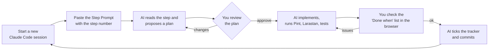

# Resort365 — Phase-wise Development Plan

Companion to [ARCHITECTURE.md](ARCHITECTURE.md). The architecture document says **what** to build; this plan says **in what order** and **how to instruct the AI** for each piece of work.

---

## 1. How to Use This Plan

The work is split into **9 phases** (0–8). Each phase is split into **steps**. One step is sized to fit one Claude Code session: a coherent piece of the system that ends in working, tested, committed code.

### 1.1 Workflow for Every Step



1. **Do the steps in order.** Later steps depend on earlier ones.
2. **One step per session.** Start a fresh session for each step (`/clear`), so the AI works from the documents, not from a long, stale conversation.
3. **Always review the plan before approving.** This is the cheapest moment to catch a misunderstanding.
4. **Check the "Done when" list yourself** in the browser before letting the AI commit.
5. **At the end of each phase**, run the Phase Review Prompt ([§1.4](#14-phase-review-prompt)) and answer the decisions needed for the next phase.

### 1.2 Step Prompt (copy, replace `X.Y`, paste)

```text
Implement Step X.Y of docs/DEVELOPMENT_PLAN.md.

1. Read CLAUDE.md, the Standard Step Rules (§2 of the plan), Step X.Y itself,
   and every docs/ARCHITECTURE.md section the step lists under "Read".
2. Plan first. Show me: the files you will create or change (migrations, models,
   enums, actions, services, controllers, requests, policies, views, routes,
   seeders, tests), your assumptions, and anything that conflicts with existing
   code or the documents. Stop and wait for my approval.
3. After I approve, implement the whole step following the Standard Step Rules.
4. Run vendor/bin/pint, vendor/bin/phpstan analyse and php artisan test.
   Fix everything until all three pass.
5. Report: what you built, how I can try it in the browser (URLs, demo logins),
   test results, and any deviations or open issues.
6. When I confirm, tick Step X.Y in the progress tracker (§3 of the plan) and
   commit with the message "feat(step-X.Y): <short summary>".
```

### 1.3 Fix Prompt (when something in a finished step is wrong)

```text
In Step X.Y (docs/DEVELOPMENT_PLAN.md), this is wrong: <describe what you saw,
where, and what you expected>. Find the cause, fix it, add a test that would
have caught it, run Pint, Larastan and the tests, then show me the change.
```

### 1.4 Phase Review Prompt

```text
Phase N of docs/DEVELOPMENT_PLAN.md is complete. Review the phase before we move on:
1. Run the full test suite, Pint and Larastan, and report the results.
2. Check every tenant-owned model added in this phase is in the tenant
   isolation test dataset, and the module-boundary architecture tests pass.
3. Check each item in the phase's "Exit criteria" and tell me which pass,
   which fail, and why.
4. Make sure DemoSeeder lets me demo everything in this phase.
5. List any places where the code differs from docs/ARCHITECTURE.md and
   propose document updates.
Do not start the next phase.
```

After the review, also run `/code-review high` for an independent bug hunt over the phase's changes.

---

## 2. Standard Step Rules

These apply to **every** step. Step 0.1 copies them into `CLAUDE.md`, so the AI sees them in every session.

| # | Rule |
|---|---|
| R1 | **Scope:** build only what the step lists. If a later step's feature seems necessary, add a contract or a clearly marked `TODO(step-X.Y)` and mention it in the report. Do not build it. |
| R2 | **Tenancy:** every new tenant-owned table has `tenant_id` (and `property_id` where the data belongs to one resort). Its model uses `BelongsToTenant` / `BelongsToProperty`, and the model is added to the tenant-isolation test dataset. |
| R3 | **Migrations:** foreign keys, composite indexes starting with `tenant_id`, `DECIMAL(15,2)` for money, `DATE` for stay dates. Never edit a migration from an earlier committed step; add a new migration. |
| R4 | **Models:** casts, PHP backed enums for statuses and types, relationships, and a factory with realistic data. Activity logging on business models. |
| R5 | **Logic:** in Actions and Services only, never in controllers, models or Blade. Multi-row writes in `DB::transaction()`. Events dispatched after commit. |
| R6 | **Modules:** other modules are used only through their Contracts, DTOs, Enums and Events (see ARCHITECTURE §4.3). |
| R7 | **Validation:** FormRequests; every `exists` and `unique` rule is tenant-scoped. |
| R8 | **Authorization:** permissions named `module.resource.action`, registered in the module's service provider, enforced by policies and route middleware, and assigned to the default roles seeder. |
| R9 | **UI:** AdminLTE layout and the shared Blade components; server-side DataTables for lists; breadcrumbs; a sidebar menu item registered with its permission; every string through `__()`. |
| R10 | **Tests:** a feature test per action and endpoint (success, validation failure, unauthorized), unit tests for every calculation, and the tenant-isolation test. |
| R11 | **Demo data:** extend `DemoSeeder` so the step can be tried immediately after `php artisan migrate:fresh --seed`. |
| R12 | **Quality gate:** Pint, Larastan and Pest all pass before reporting the step as done. |
| R13 | **Documents:** if the implementation must differ from ARCHITECTURE.md, say so in the plan, and update the document in the same step once approved. |

### Demo data used throughout

| Tenant | Subdomain (local) | Properties |
|---|---|---|
| Rodela Eco Resort | `rodela.resort365.test` | *Rodela Eco Resort*, Cox's Bazar (8 cottages, mixed single- and multi-room) |
| Green Valley Resort | `greenvalley.resort365.test` | *Green Valley* (5 cottages) |

Each tenant gets one demo user per default role (e.g. `frontdesk@rodelaresort.com` / `password`). The two tenants must never see each other's data. This is the living proof of isolation.

---

## 3. Progress Tracker

The AI ticks a step here when it commits the step.

| Phase | Steps |
|---|---|
| **0. Foundation** | [x] 0.1 · [x] 0.2 · [x] 0.3 · [x] 0.4 · [x] 0.5 · [x] 0.6 · [x] 0.7 · [x] 0.8 |
| **1. Property & Booking** | [x] 1.1 · [x] 1.2 · [x] 1.3 · [x] 1.4 · [x] 1.5 · [x] 1.6 · [x] 1.7 · [x] 1.8 |
| **2. Front Office, Billing & Housekeeping** | [x] 2.1 · [x] 2.2 · [x] 2.3 · [x] 2.4 · [x] 2.5 · [x] 2.6 · [x] 2.7 |
| **3. Restaurant POS** | [x] 3.1 · [x] 3.2 · [x] 3.3 · [x] 3.4 · [x] 3.5 · [x] 3.6 · [x] 3.7 · [ ] 3.8 |
| **4. Accounting** | [ ] 4.1 · [ ] 4.2 · [ ] 4.3 · [ ] 4.4 · [ ] 4.5 |
| **5. Inventory & Procurement** | [ ] 5.1 · [ ] 5.2 · [ ] 5.3 · [ ] 5.4 · [ ] 5.5 · [ ] 5.6 · [ ] 5.7 · [ ] 5.8 |
| **6. HR & Payroll** | [ ] 6.1 · [ ] 6.2 · [ ] 6.3 · [ ] 6.4 · [ ] 6.5 · [ ] 6.6 |
| **7. Reports & SaaS** | [ ] 7.1 · [ ] 7.2 · [ ] 7.3 · [ ] 7.4 · [ ] 7.5 |
| **8. Online & Integrations** | [ ] 8.1 · [ ] 8.2 · [ ] 8.3 · [ ] 8.4 · [ ] 8.5 |

---

## Phase 0 — Foundation

**Goal:** a secure, multi-tenant, modular Laravel application with the AdminLTE 4 shell, login, roles and core services. Nothing resort-specific yet, but everything later phases rely on.

**Decisions needed before starting:** Q1 (shared DB vs DB per tenant), Q2 (tenant = company with several resorts), Q11 (languages).

### Step 0.1 — Project bootstrap & tooling

- **Read:** ARCHITECTURE §2, §4.6, §11, §12, §14; this plan §2.
- **Build:**
  - Fresh Laravel 13 app in the repository root (PHP 8.4), `git init`, a sensible `.gitignore`, `.env.example`.
  - MySQL 8.4 and Redis configured for local development with Laravel Herd (central domain `resort365.test`).
  - Pest, Laravel Pint, Larastan (level 6), Rector; composer scripts `test`, `lint`, `analyse`.
  - GitHub Actions workflow: install → Pint check → Larastan → Pest (MySQL + Redis services).
  - **`CLAUDE.md`** at the root: project summary, stack, links to both docs, the Standard Step Rules (§2), coding conventions (ARCHITECTURE §12), the module list, and the commands to run.
- **Done when:** the welcome page loads at `http://resort365.test`; `composer test`, `composer lint` and `composer analyse` pass; CI passes on the first commit; `CLAUDE.md` exists and is accurate.

### Step 0.2 — Module system & architecture tests

- **Read:** ARCHITECTURE §4.3, §4.4, §11.
- **Build:**
  - Install `nwidart/laravel-modules` and configure the module stubs to the structure in §11 (Actions, Contracts, DTOs, Enums, Events, …).
  - Create the **Core** module skeleton and a base `Action` class, base DTO, and an `Enum` convention with `label()` and `color()`.
  - Pest architecture tests: controllers do not use `DB`; modules do not use other modules' Models (only Contracts, DTOs, Enums, Events); no `dd`/`dump`/`ray`.
  - A short `docs/MODULE_GUIDE.md` describing how to create a new module.
- **Done when:** `php artisan module:make Sample` produces the agreed structure (then delete it); architecture tests pass and fail when deliberately violated.

### Step 0.3 — AdminLTE 4 layout & UI component library

- **Read:** ARCHITECTURE §10.1, §10.4.
- **Build:**
  - AdminLTE 4 + Bootstrap 5.3 + Bootstrap Icons via npm and Vite; Alpine.js, Tom Select, flatpickr, SweetAlert2, DataTables (Bootstrap 5) + `yajra/laravel-datatables`.
  - Layouts: `app` (sidebar + navbar + content header + footer), `guest`/`auth` (login pages), `print` (A4 documents).
  - The shared Blade components listed in §10.4, plus flash messages and a global confirm dialog.
  - Light/dark theme toggle remembered per user (later persisted to the user profile).
  - A hidden `/ui-kit` page (local only) that shows every component, for visual checking.
- **Done when:** `/ui-kit` renders every component correctly in light and dark mode and on a tablet-width screen; no console errors.

### Step 0.4 — Multi-tenancy core

- **Read:** ARCHITECTURE §2 (AD-03, AD-04), §4.2.
- **Build:**
  - `tenants` table and model (central), `TenantContext`, `IdentifyTenant` middleware (subdomain), central vs tenant route groups, a suspended-tenant page.
  - `BelongsToTenant` trait (global scope + auto-fill), `TenantRule::exists/unique` helpers, tenant-aware queued-job middleware, tenant-prefixed cache keys, tenant-prefixed storage paths.
  - **Tenant-isolation test harness:** a dataset-driven Pest test that, for every model registered in the dataset, proves tenant A cannot list, find, update or reference tenant B's records.
  - `php artisan tenant:create` command for development.
- **Done when:** two tenants on two subdomains; isolation tests pass for a sample model; a queued job restores the correct tenant; an unknown subdomain returns 404.

### Step 0.5 — Authentication & users

- **Read:** ARCHITECTURE §3.3, §5.3, §9.1.
- **Build:**
  - Create the **IAM** module. `users` scoped to a tenant (email unique per tenant); Laravel Fortify: login, logout, password reset, email verification, **TOTP 2FA**, password policy, login throttling.
  - `EnsureUserBelongsToTenant` middleware; login history; session timeout; user profile page (name, language, theme, password, 2FA).
  - Users management screens (list, invite by email, activate/deactivate).
  - Separate `platform_admins` table and `platform` guard, with a minimal login on the central domain.
- **Done when:** a Rodela user can log in only on `rodela.resort365.test`; 2FA works end to end; invitations work; a deactivated user cannot log in.

### Step 0.6 — Roles, permissions & menu registry

- **Read:** ARCHITECTURE §2 (AD-10), §3.2, §4.3, §10.2.
- **Build:**
  - `spatie/laravel-permission` with teams = tenant. A **permission registry**: each module registers its permissions (`module.resource.action`) in its provider; `php artisan permissions:sync` stores them.
  - Default roles from §3.2, seeded per tenant; role management screens (create role, tick permissions grouped by module).
  - **Menu registry:** modules register sidebar items with icon, order and required permission; the sidebar renders only what the user may see.
  - `EnsureModuleEnabled` middleware and a `tenant_modules` table (all modules enabled for now; plans come in Phase 7).
- **Done when:** a Front Desk demo user sees a different sidebar from the Accountant; a direct URL to a forbidden page returns 403.

### Step 0.7 — Core services

- **Read:** ARCHITECTURE §5.1, §9.2, §9.3.
- **Build:**
  - **Settings engine** (tenant and property level, typed, cached) with a settings screen.
  - **Document numbering** (`document_sequences`, prefix/format/yearly reset, generated under a row lock) with a setup screen.
  - **Audit log** (`spatie/laravel-activitylog`) + an audit trail component + an audit log screen for auditors.
  - **Attachments** component (`spatie/laravel-medialibrary`, S3-compatible disk, served through authorized routes).
  - Reference data: countries, currencies, timezones (seeded, ISO codes); exchange rates table.
  - Notification base: mail configuration, in-app notifications (navbar bell), a `notification_templates` table.
- **Done when:** settings save and are read back per property; 1,000 numbers generated concurrently contain no duplicates (test); every change to a sample record appears in the audit log.

### Step 0.8 — Properties & property context

- **Read:** ARCHITECTURE §4.2 (Property layer), §5.4 (properties only), §8.3 (`properties`).
- **Build:**
  - Create the **Property** module: properties CRUD (address, country, timezone, currency, check-in/out times, business date, tax number, logo).
  - `property_user` access pivot and a user-properties assignment screen.
  - `BelongsToProperty` trait; **property switcher** in the navbar; current property in session; business-date badge in the navbar.
  - `DemoSeeder` with the two demo tenants, their properties and one user per role.
- **Done when:** a user assigned to only one property can never see another property's data; the switcher changes the context everywhere; `migrate:fresh --seed` produces the full demo.

**Phase 0 exit criteria:** two demo tenants fully isolated (tests prove it); login with 2FA; permission-filtered menu; settings, numbering and audit log working; CI green.

---

## Phase 1 — Property & Booking Core

**Goal:** staff can set up a resort and take bookings for any mix of rooms and whole cottages, with a 30–50% advance deposit, with double booking impossible.

**Decisions needed before starting:** Q3 (country, currency, taxes), Q6 (room assigned at booking), Q7 (deposit rules).

### Step 1.1 — Cottages, rooms & property setup

- **Read:** ARCHITECTURE §5.4, §6.1, §8.3 (`cottage_types`, `cottages`, `room_types`, `rooms`).
- **Build:** cottage types, room types, cottages (with `booking_mode`), rooms, amenities, departments; photo galleries; a **quick "add cottage with N rooms"** form; rules: every room belongs to a cottage, room numbers unique per property, no deleting rooms with future bookings (guard prepared for Step 1.6).
- **Done when:** the demo resort has single-room and multi-room cottages set up through the UI; the cottage page lists its rooms and total occupancy.

### Step 1.2 — Guests, companies & travel agents

- **Read:** ARCHITECTURE §5.8, §8.3 (`guests`).
- **Build:** create the **Guest** module: guest profiles (encrypted ID number, ID document upload), companies, travel agents (commission %, credit limit), duplicate detection on create (same email/phone/ID), merge guests, blacklist, a `GuestLookupContract` for other modules.
- **Done when:** creating a guest with an existing phone number warns about the duplicate; ID numbers are encrypted in the database; the lookup is fast with 10,000 seeded guests.

### Step 1.3 — Tax engine, seasons, rate plans & rates

- **Read:** ARCHITECTURE §5.1 (tax engine), §5.5, §6.3.
- **Build:**
  - Core **tax engine**: taxes, tax categories, inclusive/exclusive, compound; a `TaxCalculator` service with thorough unit tests (e.g. 10% service charge then 15% VAT on the sum).
  - Create the **Rates** module: seasons, rate plans (meal plan and meal component value), rates for room types **and** cottage types by season and day of week, date overrides, restrictions (min/max stay, CTA, CTD, stop-sell); a rate grid screen (types × dates).
- **Done when:** the rate grid shows the correct nightly price for any date; tax calculator unit tests cover inclusive, exclusive and compound cases.

### Step 1.4 — Deposit, cancellation & promotions

- **Read:** ARCHITECTURE §5.5, §6.5, §8.3 (`deposit_policies`, `cancellation_policies`).
- **Build:** deposit policies (min/default/max %, due hours, auto-cancel, balance rule), cancellation policies with tiered rules, promotions and promo codes, long-stay discounts; a `DepositCalculator` and a `CancellationFeeCalculator` with unit tests.
- **Done when:** the worked example in ARCHITECTURE §6.5 is reproduced exactly by a unit test; cancellation fees are correct for each tier.

### Step 1.5 — Availability & pricing engine

- **Read:** ARCHITECTURE §6.1, §6.2, §6.3, §8.3 (`inventory_locks`, `reservation_item_nights`).
- **Build:** create the **Reservation** module core: `inventory_locks` with `UNIQUE(room_id, stay_date)`; `AvailabilityService` (free rooms, whole cottages whose rooms are all free, booking-mode rules, restrictions, occupancy); `PricingService` (nightly price with seasons, overrides, extra persons, meal plan, discounts, taxes; whole-cottage rate or sum of rooms); an **availability search screen** (dates + guests → whole cottages and rooms with prices).
- **Done when:** unit tests cover: room booked → its cottage is not available whole; cottage booked whole → none of its rooms are available; restrictions respected; the prices match the rate grid.

### Step 1.6 — Create reservation & booking wizard

- **Read:** ARCHITECTURE §6.4, §6.6, §10.3 (New Booking wizard), §8.3 (`reservations`, `reservation_items`, `reservation_guests`).
- **Build:** `CreateReservation` action (transaction, bulk lock insert, `RoomNoLongerAvailable` on unique violation, reservation code from numbering, status Tentative, deposit required and due time); the 5-step **booking wizard** (dates & guests → choose cottages/rooms → guest → pricing & deposit % between min and max → confirm); a **concurrency test** where two parallel bookings for the same room-night leave exactly one successful.
- **Done when:** a booking for 2 whole cottages + 1 room for 3 nights is created through the wizard; the deposit shows correctly; the concurrency test passes reliably.

### Step 1.7 — Reservation management, deposits & hold expiry

- **Read:** ARCHITECTURE §5.6, §5.9 (payments), §6.4, §6.5, §6.7, §8.3 (`payments`).
- **Build:**
  - Reservation list (filters: status, dates, source) and detail page (tabs: Summary, Rooms, Guests, Payments, History).
  - Modify (dates, items, guests, rate plan) with re-lock and re-price; cancel with policy fee; `reservation_logs`.
  - Create the **Billing** module with `payments` (manual methods: cash, card, bank transfer, mobile wallet), receipts (PDF), and a `PaymentReceived` event; listener auto-confirms when the deposit is met; deposit override below minimum by permission only.
  - `ExpireTentativeHolds` scheduled job (every 5 minutes).
- **Done when:** taking a 30% deposit confirms the booking automatically; an unpaid tentative booking cancels itself after the due time and its rooms become available; a date change that collides with another booking fails cleanly and keeps the original.

### Step 1.8 — Quotes, vouchers & booking notifications

- **Read:** ARCHITECTURE §5.6 (quotes, voucher), §5.1 (notifications).
- **Build:** quotes (save a priced proposal, email it, convert to a booking); confirmation voucher PDF; emails on booking created (with deposit instructions and due date), confirmed and cancelled, using editable templates; a booking-source report.
- **Done when:** the guest receives the correct email at each stage (checked with Mailpit or the log mailer); a quote converts into a booking at the quoted prices.

**Phase 1 exit criteria:** any mix of rooms and whole cottages can be booked for any number of nights; 30–50% deposit enforced and auto-confirms; unpaid holds expire; double booking impossible under the concurrency test.

---

## Phase 2 — Front Office, Billing & Housekeeping

**Goal:** the complete guest journey from arrival to check-out, with the end-of-day close and room readiness.

**Decisions needed before starting:** Q8 (revenue recognition: nightly or at check-out).

### Step 2.1 — Folios & charges

- **Read:** ARCHITECTURE §5.9, §8.3 (`folios`, `folio_lines`).
- **Build:** folios per reservation (guest, company, master), charge codes, extra services catalogue, posting charges and adjustments, voids with reason, routing rules, a **`FolioPostingContract`** (in-house check, open folio, credit limit) for other modules; a folio tab on the reservation page.
- **Done when:** extras can be posted to and voided from a folio; the contract rejects a charge for a guest who is not checked in (test).

### Step 2.2 — Front desk & check-in

- **Read:** ARCHITECTURE §5.7, §10.3 (Front Desk).
- **Build:** create the **FrontOffice** module: front-desk dashboard (arrivals, departures, in-house, VIPs, pending deposits, occupancy), check-in (ID capture, room confirm or change, collect balance or security deposit, printable registration card), walk-in booking shortcut, `GuestCheckedIn` event.
- **Done when:** a demo booking is checked in from the dashboard and appears as in-house.

### Step 2.3 — Check-out, invoices & refunds

- **Read:** ARCHITECTURE §5.9, §7.1 (settlement rows for reference).
- **Build:** check-out (settle folio, apply deposit, split payment methods, transfer to city ledger), invoices (sequential, tax breakdown, PDF, immutable) and credit notes, refunds with reason (permission-gated; the approval engine arrives in Step 5.1), city ledger accounts receivable with aging, `GuestCheckedOut` event.
- **Done when:** check-out produces a correct invoice with the deposit deducted; the balance can be moved to a company's city ledger.

### Step 2.4 — Stay changes & group bookings

- **Read:** ARCHITECTURE §6.7, §5.6 (groups).
- **Build:** room move (re-lock remaining nights), stay extension, early departure, partial check-in of a multi-room booking; group bookings with a rooming list and master folio.
- **Done when:** moving an in-house guest to another cottage frees the old room for the remaining nights; a 6-room group checks in room by room.

### Step 2.5 — Tape chart

- **Read:** ARCHITECTURE §6.8, §10.3.
- **Build:** rooms grouped by cottage × 14/30-day window (Blade + CSS Grid + Alpine.js), bars coloured by status, click empty cell → new booking prefilled, click bar → reservation, date navigation, drag-and-drop room move using the Step 2.4 action.
- **Done when:** the tape chart shows the demo bookings correctly, and dragging a booking onto an occupied room is refused with a clear message.

### Step 2.6 — Night audit, business date & cashier shifts

- **Read:** ARCHITECTURE §5.7 (night audit), §5.9 (cashier shifts).
- **Build:** night audit wizard and scheduled job per property (steps from §5.7; the restaurant-session check is added in Step 3.7): post room charges to folios, no-shows with policy fee, release expired holds, package split of room vs meal component, daily statistics snapshot, advance business date; cashier shift open/close with cash count; the daily flash report.
- **Done when:** running night audit posts one night's charges to every in-house folio, marks a demo no-show, and the business date advances; running it twice for the same date is impossible.

### Step 2.7 — Housekeeping & maintenance

- **Read:** ARCHITECTURE §5.11.
- **Build:** create the **Housekeeping** module: room status board, housekeeping tasks (auto-created on check-out and daily for occupied rooms), attendant assignment, inspection; out-of-order blocks that insert `inventory_locks`; maintenance work orders; preventive schedules; lost & found.
- **Done when:** checking out makes the room dirty and creates a cleaning task; an OOO block makes the room unavailable in the availability search.

**Phase 2 exit criteria:** booking → check-in → extras → night audit → check-out → invoice works end to end; room status follows the guest journey.

---

## Phase 3 — Restaurant POS

**Goal:** the resort's restaurants and bars take orders on tablets, the kitchen receives tickets instantly, and bills are paid directly or charged to the guest's room.

**Decisions needed before starting:** Q16 (outlets), Q17 (printers), Q18 (KDS vs printed KOT), Q19 (offline requirement), Q20 (NBR fiscal requirement), Q22 (meal plans).

### Step 3.1 — Outlets, stations, printers & floor plan setup

- **Read:** ARCHITECTURE §5.10.1, §5.10.3, §8.4 (`outlets`, `pos_terminals`, `kitchen_stations`, `printers`, `dining_areas`, `dining_tables`).
- **Build:** create the **Restaurant** module: outlets, POS terminals (device registration token), kitchen stations, printers, `outlet_user` access, dining areas and tables with a **drag-and-drop floor plan editor**.
- **Done when:** the demo resort has a Main Restaurant (2 areas, 12 tables), a Pool Bar and Room Service, each with stations; the floor plan saves table positions.

### Step 3.2 — Menu management

- **Read:** ARCHITECTURE §5.10.2, §8.4 (menu tables).
- **Build:** menu categories, items (multi-language name, image, station, course, tax category, dietary tags, allergens), variants, modifier groups and modifiers, combos, menu schedules, **outlet price list** screen, 86 (sold-out) flag, direct-stock items (link to inventory item deferred to Step 5.7), CSV import of menu items.
- **Done when:** a realistic demo menu (≈60 items, with variants and modifiers) is priced differently in two outlets.

### Step 3.3 — POS layout, sessions & manager PIN

- **Read:** ARCHITECTURE §2 (AD-15), §3.3 (rules 5–6), §5.10.11, §10.1 (POS layout).
- **Build:** the full-screen touch `pos` layout; terminal sign-in; fast user switch by PIN; **manager PIN approval** component; POS sessions (open with float, X report, close with denomination count, variance, Z report, cannot close with open bills).
- **Done when:** a cashier opens a session on a tablet-width screen, switches user by PIN, and closes the session with a Z report.

### Step 3.4 — Orders & kitchen tickets

- **Read:** ARCHITECTURE §5.10.4, §5.10.5, §5.10.6, §8.4 (`pos_orders`, `pos_order_lines`, `kots`).
- **Build:** POS floor plan (live table tiles); order screen (category/item grid, search, modifiers modal, seat and course, notes); order types dine-in and takeaway; **Send** → KOTs grouped by station with sequential numbers; hold & fire courses; void after sending (reason + permission or manager PIN, void KOT); table transfer and merge; printable KOT (80 mm browser print). JSON endpoints under `/pos/api` reuse the Actions (ARCHITECTURE §12, rule 15).
- **Done when:** a waiter opens a table, orders 5 items with modifiers in under a minute, sends them, and two KOTs print for two stations; a voided item needs the manager PIN.

### Step 3.5 — Real-time & kitchen display

- **Read:** ARCHITECTURE §2 (AD-17), §4.5 (restaurant events), §10.1 (KDS layout), §10.3 (Kitchen display).
- **Build:** Laravel Reverb + Echo (tenant- and outlet-scoped private channels); **kitchen display** (New · Preparing · Ready columns, elapsed-time colours, allergy highlight, bump); ready notification on the waiter's POS; live table status and 86 updates on all terminals; polling fallback if WebSockets fail.
- **Done when:** an item sent from a tablet appears on the KDS within 2 seconds; marking it ready notifies the POS; channels never leak between tenants (test).

### Step 3.6 — Bills, discounts & payments

- **Read:** ARCHITECTURE §5.10.7, §5.10.13, §8.4 (`pos_bills`, `pos_bill_lines`, `pos_payments`).
- **Build:** print bill (pre-check), reopen by permission, discounts (item/bill, reason, max % per role), service charge and tax via the Core tax engine, **split bill** (by item, seat, equal, amount), multiple payments (cash with change, card, wallet, bank transfer), tips, complimentary bills, receipts (sequential per outlet, reprint marked COPY), manager void of settled bill (same business date), `RestaurantBillSettled` / `RestaurantBillVoided` events.
- **Done when:** a 4-person table split equally is settled by cash + card; unit tests prove split bills always add up to the order total, including rounding.

### Step 3.7 — Charge to room, packages & night audit integration

- **Read:** ARCHITECTURE §2 (AD-16), §5.10.8, §5.10.9, §7.1 (restaurant rows), §8.4 (`package_redemptions`).
- **Build:** **charge to room** through `FolioPostingContract` (room/guest search, signature capture, rejection handling), city ledger settlement, "no room charges" flag on reservations; **meal-plan redemption** with entitlement check and package menu; folio lines link back to restaurant bills (flag `revenue_posted_by_source`); night audit step: block until all POS sessions are closed.
- **Done when:** a room-service-style bill charged to an in-house guest appears on their folio and on the check-out invoice; a checked-out guest cannot be charged; a CP guest's breakfast is redeemed at zero and counted.

### Step 3.8 — Room service, table reservations & restaurant reports

- **Read:** ARCHITECTURE §5.10.4, §5.10.12, §5.10.14.
- **Build:** room service and location delivery with delivery status; staff meal order type; restaurant table reservations (linked to the floor plan); reports: sales by outlet/category/item/hour/waiter/payment method, covers and average spend, exceptions (voids, discounts, comps), room-charge summary, package redemption vs entitlement, X/Z history.
- **Done when:** the F&B Manager can answer "what did the Pool Bar sell yesterday, who voided what, and how many breakfasts were included vs taken" from the reports.

**Phase 3 exit criteria:** tablet order → KDS → bill → cash/card/room-charge settlement works end to end; restaurant charges appear on the guest's check-out invoice; sessions reconcile cash.

---

## Phase 4 — Accounting

**Goal:** every financial event from the resort and restaurant produces correct double-entry journals, and the owner gets real financial statements.

**Decisions needed before starting:** Q8 confirmed; your chart of accounts preferences (keep USALI seed or import your own).

### Step 4.1 — Chart of accounts, periods & journals

- **Read:** ARCHITECTURE §5.14, §7.2.
- **Build:** create the **Accounting** module: chart of accounts (tree, USALI-aligned seed, editable), fiscal years and periods (open/close/lock), manual journal entries (draft → post → reverse), dimensions (property, department, party), invariants enforced and tested (balanced, immutable once posted, closed periods blocked).
- **Done when:** a manual journal posts; an unbalanced one is refused; posting into a closed period is refused; a posted entry can only be reversed.

### Step 4.2 — Account mapping & automatic posting (Billing)

- **Read:** ARCHITECTURE §4.5, §7.1 (booking and billing rows).
- **Build:** account mapping screen with defaults; a `PostingService` (idempotent: unique source + event); listeners for deposits received, night audit revenue (with package split to F&B revenue), extra charges, check-out settlements, city ledger transfers, cancellation fees, refunds; a **back-posting command** to post events from Phases 1–3 demo data.
- **Done when:** after running the demo guest journey, the trial balance balances and Customer Advances equals the deposits held for future stays.

### Step 4.3 — Restaurant posting, income & expense vouchers

- **Read:** ARCHITECTURE §7.1 (restaurant rows).
- **Build:** listeners for restaurant bills (cash/card/room charge/city ledger), tips, comps (cost posted in Step 5.7), session over/short, voids (reversal); quick income vouchers and expense vouchers with attachments.
- **Done when:** a day of demo restaurant sales produces food and beverage revenue by outlet, with room-charge bills not counted twice (test).

### Step 4.4 — Cash, bank & reconciliation

- **Read:** ARCHITECTURE §5.14.
- **Build:** bank and cash accounts, transfers, cheque register, bank statement import (CSV), matching and reconciliation screen, reconciliation report.
- **Done when:** a demo bank statement is imported and reconciled against the recorded payments.

### Step 4.5 — Financial statements & ledgers

- **Read:** ARCHITECTURE §5.14, §5.17.
- **Build:** trial balance, general ledger with drill-down to source documents, P&L by property and department, balance sheet, cash flow, USALI departmental report, AR and AP aging, consolidated view across properties; Excel/PDF export.
- **Done when:** clicking any P&L figure drills down to the journal lines and then to the original booking, bill or payment.

**Phase 4 exit criteria:** trial balance always balances; statements are consistent with operational reports (e.g. room revenue = sum of night audit postings).

---

## Phase 5 — Inventory & Procurement

**Goal:** everything the resort buys is requested, approved, ordered, received, stocked, issued or consumed, and costed.

**Decisions needed before starting:** Q15 (central warehouse), Q21 (recipe costing), approval thresholds for PR/PO.

### Step 5.1 — Approval workflow engine

- **Read:** ARCHITECTURE §5.1 (approval engine).
- **Build:** generic approval engine in Core (workflows per document type, amount thresholds, multi-level, delegation, approve/reject with comment, notifications, `<x-approval-panel>`); retrofit refunds (Step 2.3) to use it.
- **Done when:** a refund above the threshold waits for the General Manager's approval and is paid only after it.

### Step 5.2 — Items, units & stores

- **Read:** ARCHITECTURE §5.12, §8.5 (Inventory tables).
- **Build:** create the **Inventory** module: item categories, units and conversions, items (SKU, barcode, reorder level/qty, par levels, batch/expiry flag), stores linked to property and department; outlets linked to stores; item import from CSV.
- **Done when:** the demo resort has main, kitchen, bar and housekeeping stores and about 150 items.

### Step 5.3 — Stock ledger, balances & transfers

- **Read:** ARCHITECTURE §5.12 (movements, rules).
- **Build:** immutable `stock_movements`, `stock_balances` with weighted-average cost updated in the same transaction, **`StockMovementContract`**, opening balances, adjustments, two-step inter-store transfers, negative stock rule, `StockBelowReorderLevel` event; stock on hand and movement history screens.
- **Done when:** unit tests prove weighted-average cost is correct across receipts at different prices; concurrent issues never produce a wrong balance.

### Step 5.4 — Requisitions, issues & stock count

- **Read:** ARCHITECTURE §5.12.
- **Build:** department store requisitions → approval → issue (`StockIssued` event); housekeeping amenity issues; physical stock count (freeze, count sheets, variance, adjustment); accounting listeners for issues and adjustments.
- **Done when:** a kitchen requisition is approved and issued, the stock falls, and the department cost appears in the P&L.

### Step 5.5 — Vendors, requisitions, RFQs & purchase orders

- **Read:** ARCHITECTURE §5.13.
- **Build:** create the **Procurement** module: vendors (contacts, bank, terms, price list), purchase requisitions (manual and from reorder suggestions), RFQs and quotation comparison, purchase orders with amount-based approval, PO PDF emailed to the vendor.
- **Done when:** a PR becomes an approved PO, emailed as a PDF.

### Step 5.6 — Goods receipt, vendor bills, payments & returns

- **Read:** ARCHITECTURE §5.13, §7.1 (procurement rows).
- **Build:** GRN against PO (partial receipts, rejected quantities, receiving store → stock in), vendor bills with **3-way match** and tolerance, service bills without PO, vendor payments against several bills, advances, purchase returns with debit notes; accounting listeners (GRNI, AP, payments).
- **Done when:** PO → two partial GRNs → bill → payment flows through stock and the GL; a bill that exceeds the received quantity is blocked by the 3-way match.

### Step 5.7 — Recipes & food costing

- **Read:** ARCHITECTURE §5.10.10, §7.1 (recipe consumption, wastage, comps).
- **Build:** recipes and sub-recipes for menu items, variants and modifiers; plate cost and food cost % on the menu screen; link direct-stock menu items to inventory items; queued **sale consumption** on `RestaurantBillSettled` (reversal on void); wastage entries; comp and staff meal cost posting.
- **Done when:** selling 10 demo burgers deducts the exact ingredient quantities from the kitchen store and posts food cost of sales.

### Step 5.8 — Inventory & procurement reports

- **Read:** ARCHITECTURE §5.12, §5.13, §5.10.14.
- **Build:** stock valuation, consumption by department, slow-moving and expiry, reorder suggestions, open POs and pending GRNs, vendor ledger, AP aging, purchase price variance, **theoretical vs actual** kitchen consumption, food and beverage cost %.
- **Done when:** after a stock count, the theoretical vs actual report shows the variance per ingredient.

**Phase 5 exit criteria:** purchase-to-pay and requisition-to-issue work end to end; restaurant sales consume stock; stock value in the balance sheet equals the stock valuation report.

---

## Phase 6 — HR & Payroll

**Goal:** staff records, attendance and leave, and a monthly payroll that is paid and posted.

**Decisions needed before starting:** Q9 (Bangladesh statutory items to include), Q23 (tips and service charge rules).

### Step 6.1 — Organisation & employees

- **Read:** ARCHITECTURE §5.15, §8.5 (HR tables).
- **Build:** create the **HR** module: designations, grades, employees (encrypted IDs and bank details, documents, optional user link), lifecycle history (confirmation, transfer, promotion, increment, disciplinary, exit), employee directory.
- **Done when:** the demo tenant has about 60 employees across departments and both properties.

### Step 6.2 — Shifts, rosters, attendance & holidays

- **Read:** ARCHITECTURE §5.15.
- **Build:** shifts, weekly/monthly roster per department, attendance (manual, CSV import from biometric devices), late/early/overtime calculation, holiday calendar per property.
- **Done when:** a month of imported attendance shows lateness and overtime per employee.

### Step 6.3 — Leave management

- **Read:** ARCHITECTURE §5.15.
- **Build:** leave types, policies (entitlement, accrual, carry forward), balances, requests with approval (engine from Step 5.1), leave calendar.
- **Done when:** a leave request is approved and the balance and the roster reflect it.

### Step 6.4 — Salary setup & Bangladesh starter pack

- **Read:** ARCHITECTURE §5.16.
- **Build:** create the **Payroll** module: salary components (fixed, % of component, formula; taxable flag), salary structures, effective-dated employee salaries, income tax slabs; the **Bangladesh starter pack** seeder (tax slabs, provident fund, gratuity, festival bonuses), editable.
- **Done when:** an employee's monthly gross, deductions and tax are shown correctly for the configured structure (unit tests with worked examples).

### Step 6.5 — Payroll run, payslips & loans

- **Read:** ARCHITECTURE §5.16.
- **Build:** payroll run per property and month (draft → calculate from attendance, overtime, unpaid leave, loans → review/adjust → approve → pay → lock), payslips (PDF, email), loans and salary advances with installments, bank transfer export file, payroll register; accounting listeners (`PayrollApproved`, `PayrollPaid`).
- **Done when:** a demo month's payroll is calculated, approved, paid and posted, and cannot be edited afterwards.

### Step 6.6 — Service charge & tips distribution, HR reports

- **Read:** ARCHITECTURE §5.16, §7.1 (distribution rows).
- **Build:** service charge pools and tips pools per period, distribution rules (equal, points, days worked), inclusion in the payroll run, accounting postings; HR/payroll reports (headcount, attendance summary, leave balances, payroll cost by department, festival bonus register).
- **Done when:** a month's collected service charge and tips are distributed to eligible staff through payroll and cleared from the liability accounts.

**Phase 6 exit criteria:** attendance → leave → payroll → payment → GL works for a full month; payslips are correct against hand-calculated examples.

---

## Phase 7 — Reports & SaaS Platform

**Goal:** owners get a management view, and Resort365 becomes a sellable SaaS product.

**Decisions needed before starting:** Q12 (SaaS billing), plan names, limits and prices.

### Step 7.1 — Management dashboard & KPI reports

- **Read:** ARCHITECTURE §5.17, §10.3 (Dashboards).
- **Build:** create the **Reports** module: report framework (filters, property or consolidated, queued Excel/PDF export with notification); management dashboard (occupancy, ADR, RevPAR, revenue, F&B sales, cash); rooms reports (forecast, pace, source mix, cancellations, length of stay); guest reports.
- **Done when:** the dashboard loads in under 2 seconds with a year of demo data; exports arrive as notifications.

### Step 7.2 — F&B analytics & budgets

- **Read:** ARCHITECTURE §5.10.14, §5.14 (budgets).
- **Build:** menu engineering matrix (stars, plowhorses, puzzles, dogs), F&B trends, annual budgets per account and department, budget vs actual.
- **Done when:** the menu engineering chart classifies demo items correctly; budget vs actual shows variances by month.

### Step 7.3 — Platform console, plans & entitlements

- **Read:** ARCHITECTURE §5.2, §4.2 (central tables).
- **Build:** create the **Platform** module: super-admin console (tenants, usage, suspend/reactivate, audited impersonation, announcements), plans with limits and module entitlements, enforcement (menus, routes, limits with friendly upgrade messages).
- **Done when:** moving a demo tenant to the Starter plan hides Restaurant, Inventory and Accounting, and blocks adding a room over the limit.

### Step 7.4 — Sign-up, onboarding & subscriptions

- **Read:** ARCHITECTURE §4.2 (onboarding flow), §5.2.
- **Build:** public sign-up on the central domain, trial, onboarding wizard (company, first property, currency, timezone, taxes, cottages and rooms, default roles, chart of accounts, sequences); subscriptions and platform invoices (manual first, Cashier-ready); tenant data export on exit.
- **Done when:** a brand-new resort signs up and takes its first booking without any developer help.

### Step 7.5 — Hardening

- **Read:** ARCHITECTURE §9, §13, §14.
- **Build:** performance pass (indexes, N+1 checks, caching), security review (`/security-review`), security headers, rate limits, backup and restore procedure, Pulse and error tracking, production deployment scripts, zero-downtime deploy.
- **Done when:** load test of 50 concurrent users on booking and POS shows no errors; a backup is restored successfully on staging.

**Phase 7 exit criteria:** a second, real resort company can be onboarded self-service on production.

---

## Phase 8 — Online & Integrations

**Goal:** guests book and pay online; the system connects to the outside world.

**Decisions needed before starting:** Q4 (payment gateway — e.g. SSLCommerz / bKash for Bangladesh, Stripe for international cards), Q5 (booking website), Q17 (silent printing).

### Step 8.1 — REST API v1

- **Read:** ARCHITECTURE §9.6.
- **Build:** Sanctum tokens, versioned `/api/v1` for availability, quotes, reservations, guests, folios; API resources; consistent errors; rate limits; OpenAPI documentation.
- **Done when:** the OpenAPI document is published and an API test suite covers every endpoint, including tenant isolation.

### Step 8.2 — Public booking engine

- **Read:** ARCHITECTURE §1.4, §6, §9.6.
- **Build:** a public booking site per property (search, choose cottages/rooms, guest details, pay deposit), embeddable widget, branding per tenant, anti-abuse throttling, booking management link for guests.
- **Done when:** a guest books two rooms on the public site on a phone, and the booking appears on the tape chart as Tentative.

### Step 8.3 — Payment gateways

- **Read:** ARCHITECTURE §5.9 (gateway abstraction), §9.1.
- **Build:** `PaymentGateway` contract, the first gateway adapter(s), payment links for deposit requests, webhooks with signature verification and idempotency, gateway logs, online refunds.
- **Done when:** paying the deposit online confirms the booking automatically; replaying a webhook does not create a second payment.

### Step 8.4 — Notifications & guest portal

- **Read:** ARCHITECTURE §5.1 (notifications).
- **Build:** SMS provider adapter, notification template editor, pre-arrival and post-stay emails, guest portal (view booking, pay balance, download invoice).
- **Done when:** a guest receives the pre-arrival message three days before arrival and pays the balance from the portal.

### Step 8.5 — Silent printing

- **Read:** ARCHITECTURE §4.6 (printing), §14 (POS devices).
- **Build:** QZ Tray (or a small local print agent) integration for silent KOT and receipt printing to network ESC/POS printers, with per-station printer mapping and a browser-print fallback.
- **Done when:** sending an order prints the KOT at the station printer with no print dialog.

**Phase 8 exit criteria:** end-to-end online booking with online deposit payment; silent printing in the restaurant.

---

## 4. Tips for Working with the AI

- **Keep the documents the source of truth.** When you change your mind about a feature, update ARCHITECTURE.md first (or ask the AI to), then implement.
- **Small corrections are cheaper during planning** than after implementation. Read the plan carefully.
- **Give feedback with specifics:** the URL, what you clicked, what you expected, and what happened.
- **Don't let a step grow.** If a step turns out to be too big, ask the AI to split it into X.Ya and X.Yb and update this plan.
- **Review the risky code yourself:** tenancy scoping, inventory locks, deposit and pricing maths, accounting postings, payroll calculations, and POS bill totals.
- **Use `/code-review`** at the end of each phase, and `/security-review` before going live.
